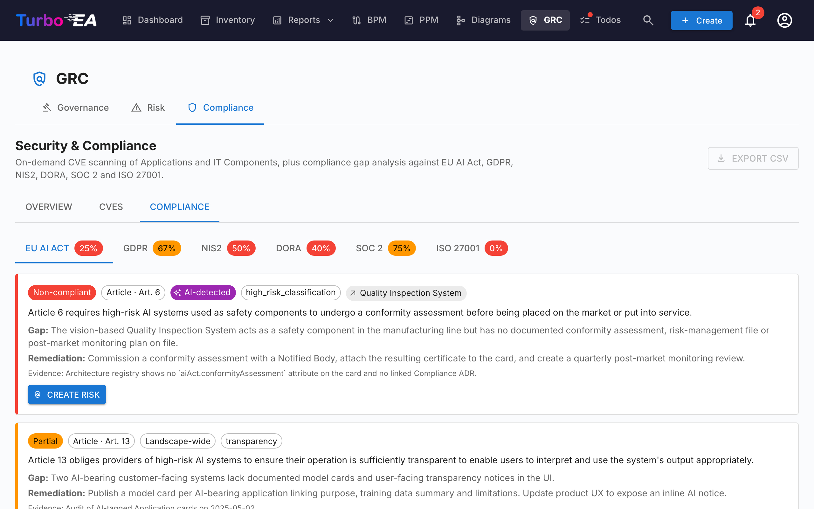

# الامتثال

علامة تبويب **الامتثال** في [وحدة GRC](grc.md) على المسار `/grc?tab=compliance` هي **سجل ثنائي المصدر**: كل نتيجة إما أُلّفت بواسطة مراجع أو أُنتجت عبر فحص بالذكاء الاصطناعي مقابل لائحة، وكلا نوعَي النتائج يعيشان ويُفرَزان جنبًا إلى جنب في الشبكة نفسها.



!!! note
    تُشحَن ست لوائح مُفعَّلة افتراضيًا — **EU AI Act** و**GDPR** و**NIS2** و**DORA** و**SOC 2** و**ISO/IEC 27001**. يستطيع المسؤولون تفعيل أو تعطيل أو إضافة لوائح مخصّصة (مثل HIPAA، أو أُطر السياسات الداخلية) ضمن [**الإدارة ← النموذج الفوقي ← اللوائح**](../admin/metamodel.md#compliance-regulations).

## طريقتان لوصول النتائج إلى السجل

| المصدر | مَن ينشئها | متى تُستخدم |
|--------|----------------|-------------|
| **يدوي** | مستخدم يملك `compliance.manage` ينقر **+ New finding** على شبكة الامتثال | الالتزامات المقادة بالتدقيق، والفجوات المُبلَّغ عنها خارجيًا، وشهادات الأطراف الثالثة، وأي شيء تريد تتبعه ولا يُبرزه فحص LLM |
| **فحص بالذكاء الاصطناعي** (TurboLens) | مستخدم يملك `compliance.manage` يطلق فحصًا من شريط أدوات الامتثال | تحليل دوري لفجوات المشهد مقابل اللوائح المُفعَّلة |

يتشارك المساران نموذج البيانات ودورة الحياة نفسها. لا يحذف الفحص نتيجة يدوية ولا يتجاوزها، ويمكن ترقية النتيجة المُدخَلة يدويًا إلى مخاطرة، وانتشارها خلفيًا من إغلاق مخاطرة، واتخاذ إجراء جماعي عليها تمامًا كنتيجة كشفها الذكاء الاصطناعي.

## تأليف نتيجة يدويًا

انقر **+ New finding** في شريط أدوات الامتثال لفتح نافذة الإنشاء. الحقول المطلوبة:

| الحقل | الوصف |
|-------|-------------|
| **اللائحة** | اختر إحدى اللوائح المُفعَّلة. تحدّد منتقي المواد. |
| **المادة** | معرّف نصي حر (`Art. 6`، `§ 32`، `Annex II`، …). يُطبَّع عند الحفظ كي لا تكرر عمليات إعادة الفحص الصف. |
| **المتطلب** | البند أو الضبط الذي تتتبعه. |
| **الحالة** | `new`، `in_review`، `mitigated`، `verified`، `accepted`، `not_applicable`، `risk_tracked`. الافتراضية `new`. |
| **الخطورة** | `low`، `medium`، `high`، `critical`. |
| **الفجوة** | وصف الفجوة أو الملاحظة. |
| **الدليل** | الأدلة الداعمة، وملاحظات التدقيق، والروابط. |
| **المعالجة** | المعالجة المقترحة. تُستخدم بذرةً لمهمة التخفيف إذا رقّيت النتيجة لاحقًا إلى مخاطرة. |
| **البطاقة المرتبطة** | اختياري — حدّد نطاق النتيجة لتطبيق أو مكوّن تقني أو بطاقة أخرى بعينها. |
| **المخاطرة المرتبطة** | اختياري — اربط مسبقًا بمخاطرة موجودة إن كانت تتتبع هذه الفجوة بالفعل. |

يُطلب `compliance.manage` لإنشاء النتائج أو تحريرها أو سحبها أو اتخاذ إجراء جماعي عليها. ويكفي `compliance.view` لقراءة السجل والفرز من علامة تبويب الامتثال على مستوى البطاقة.

## تشغيل فحص بالذكاء الاصطناعي

!!! info "الذكاء الاصطناعي مطلوب للفحوصات، لا للنتائج اليدوية"
    تعمل النتائج اليدوية في أي نشر. تتطلب فحوصات الذكاء الاصطناعي مزوّد ذكاء اصطناعي تجاريًا (Anthropic Claude أو OpenAI أو DeepSeek أو Google Gemini) مُهيّأ في [إعدادات الذكاء الاصطناعي](../admin/ai.md).

أشّر على اللوائح المراد تضمينها وانقر **Run compliance scan**. يعمل الفحص في الخلفية بوصفه [عملية تحليل في TurboLens](turbolens.md#analysis-history):

1. **تحميل البطاقات** — تُسحب لقطة المشهد الحية.
2. **الكشف الدلالي بالذكاء الاصطناعي** — يُفحَص اسم كل بطاقة ووصفها ومزوّدها وواجهاتها ذات الصلة بحثًا عن إشارات AI / ML (نماذج LLM، ومحركات التوصية، ورؤية الحاسوب، وكشف الاحتيال أو تقييم الائتمان، وروبوتات المحادثة، والتحليلات التنبؤية، وكشف الشذوذ). تحمل البطاقات المُعلَّمة هنا شريحة `AI-detected` في الشبكة حتى عندما لا يكون نوعها الفرعي `AI Agent` / `AI Model`.
3. **الفحص لكل لائحة** — يشغّل LLM المُهيّأ قائمة تحقق اللائحة مقابل البطاقات المحدّدة النطاق.

تعرض الصفحة شريط تقدّم حيًا واعيًا بالمراحل. **تحديث الصفحة لا يقطع الفحص** — تبقى المهمة الخلفية قيد التشغيل على جانب الخادم، وتعيد الواجهة ربط حلقة الاستطلاع عند التحميل عبر `/turbolens/security/active-runs`.

يستبدل الفحص فقط نتائج اللوائح التي حدّدت نطاقها. تبقى نتائج اللوائح الأخرى سليمة.

## كيف تتعايش النتائج اليدوية ونتائج الذكاء الاصطناعي

تُدرَج نتائج الامتثال أو تُحدَّث (upsert) حسب `(scope, card, regulation, normalised_article)`. يبقي هذا المفتاح المصدرَين من التصادم:

- **النتيجة اليدوية** التي سينتجها الفحص التالي بالذكاء الاصطناعي أيضًا تُوفَّق مع الصف الموجود — فيبقى دليلك وملاحظات المراجع وحالتك؛ ولا يُحدَّث إلا نص الفجوة / المعالجة من LLM إن تغيّر.
- **النتيجة المكشوفة بالذكاء الاصطناعي** التي لم يعد المرور التالي يبلّغ عنها **لا تُحذف**. بل تُعلَّم بـ `auto_resolved=true` وتُخفى افتراضيًا، فيبقى سجلها وأي رابط خلفي لمخاطرة مُرقّاة سليمًا.
- **حكم المستخدم بشأن الذكاء الاصطناعي** على بطاقة (`hasAiFeatures = true / false`) يبقى ثابتًا. إذا أكّدت أو رفضت تصنيف LLM لاحتواء الذكاء الاصطناعي، تتجاوز ذلك القرار الكاشفَ في الفحوصات اللاحقة — فلا يستطيع انجراف LLM إعادة تحديد نطاق نتيجة صامتًا.

## سير عمل الحالة

تتبع النتائج مسارًا رئيسيًا من 4 حالات مع 3 فروع جانبية، تُعرَض كخط زمني أفقي للمراحل في درج النتيجة:

```
new → in_review → mitigated → verified
                      ↘ accepted          (side branch, requires rationale)
                      ↘ not_applicable    (side branch, scope review)
                      ↘ risk_tracked      (set automatically on promote-to-Risk)
```

تقتصر الانتقالات على المستخدمين الذين يملكون `compliance.manage`. يطبّق المحرّك الانتقالات على جانب الخادم ويرفض التحركات غير المشروعة بخطأ واضح.

لا تُضبَط `risk_tracked` يدويًا أبدًا — بل تُكتب تلقائيًا عند نقرك **Create risk** على نتيجة، وتُمسَح بواسطة محرّك الانتشار الخلفي للمخاطرة عند إغلاق المخاطرة المرتبطة.

## ترقية نتيجة إلى سجل المخاطر

تحمل كل بطاقة نتيجة (يدوية أو مكشوفة بالذكاء الاصطناعي) إجراءً أساسيًا **Create risk**. يفتح النقر عليه نافذة إنشاء المخاطرة المشتركة بعنوان ووصف وفئة واحتمالية وأثر وبطاقة متأثرة **مملوءة مسبقًا من النتيجة**. يمكنك تحرير أي حقل قبل الإرسال، وإسناد **مالك**، واختيار **تاريخ حل مستهدف**.

عند الإرسال، يتحوّل صف النتيجة إلى **Open risk R-000123** كي يبقى الرابط مرئيًا. الإجراء **عديم الأثر الجانبي** — والنقر عليه مجددًا ينتقل إلى المخاطرة الموجودة بدلًا من إنشاء نسخة مكررة.

تُولَّد مهمة تخفيف لمرة واحدة تلقائيًا على المخاطرة الجديدة، مزروعة من نص **المعالجة** في النتيجة — فيتحوّل تحليل الفجوة إلى عمل قابل للتنفيذ ومملوك على الفور. انظر [سجل المخاطر ← الترقية من نتيجة امتثال في TurboLens](risks.md#promoting-from-a-turbolens-compliance-finding) لمعرفة دورة الحياة الكاملة وكيف يُنشئ إسناد المالك مهمة متابعة + إشعار جرس.

عندما تبلغ المخاطرة المرتبطة لاحقًا `mitigated` أو `monitoring` أو `closed` أو `accepted` (أو تُحذف)، ينقل محرّك الانتشار الخلفي تلقائيًا كل نتيجة امتثال مرتبطة إلى الحالة المطابقة (`mitigated` أو `verified` أو `accepted` أو العودة إلى `in_review`). ويُعكَس مبرر القبول المُلتقَط على المخاطرة في ملاحظة مراجعة النتيجة كي يبقى مسار التدقيق متسقًا.

## الشبكة والترشيح والإجراءات الجماعية

تعكس شبكة الامتثال شبكة [المخزون](inventory.md): شريط جانبي للترشيح مع مفاتيح تبديل لظهور الأعمدة، وفرز دائم، وبحث نصي كامل، ودرج تفاصيل لكل نتيجة.

عند منح `compliance.manage`، تكشف الشبكة عن تحديد متعدد واعٍ بالمرشّحات. أشّر على مربع اختيار الرأس لتحديد كل صف يطابق المرشّحات النشطة، ثم استخدم شريط الأدوات الملتصق:

- **Edit decision** — انتقل دفعةً واحدةً بكل نتيجة محدّدة إلى حالة مختارة (مثل تعليم شريحة من النتائج بأنها `not_applicable` بعد مراجعة نطاق). تُبرز الانتقالات غير المشروعة لكل صف في ملخص نجاح جزئي بدلًا من إفشال الدفعة بأكملها.
- **Delete** — أزِل النتائج نهائيًا (يُستخدم لتنظيف نتائج لائحة عطّلتها منذ ذلك الحين).

تبقى الترقية إلى مخاطرة إجراءً لصف واحد — لا تُتاح الترقية الجماعية عمدًا للحفاظ على التقاط السياق لكل نتيجة.

## مؤشرات النظرة العامة

تُظهر علامة تبويب الامتثال أيضًا **مؤشر امتثال إجمالي** أعلى الصفحة و**خريطة حرارية مدمجة لكل لائحة**. انقر على أي خلية من الخريطة الحرارية للتعمّق في الشبكة المحدّدة النطاق لتلك الفئة من اللائحة × الحالة.

## الامتثال على بطاقة واحدة


البطاقات الداخلة في نطاق أي نتيجة تُبرز أيضًا علامة تبويب **الامتثال** على صفحة تفاصيلها (مقيّدة بـ `compliance.view`). تسرد كل نتيجة مرتبطة حاليًا بالبطاقة بنفس إجراءات الإقرار / القبول / **Create risk** / **Open risk** كما في عرض GRC، كي يستطيع مالك التطبيق فرز نتائجه دون مغادرة البطاقة. تنطبق قاعدة الإخفاء التلقائي نفسها على علامة تبويب **المخاطر** في تفاصيل البطاقة: لا تظهر العلامتان إلا عندما يكون للبطاقة فعليًا عناصر مرتبطة، فلا تحمل البطاقات التي لا نشاط GRC لها علامات تبويب فارغة.

## بيانات العرض التوضيحي

يملأ `SEED_DEMO=true` مجموعة منتقاة يدويًا من نتائج الامتثال النموذجية (عبر اللوائح الست المدمجة ومزيج من حالات دورة الحياة) مقابل بطاقات العرض التوضيحي NexaTech، فتكون علامة التبويب قابلة للاستخدام جاهزة دون تهيئة مزوّد ذكاء اصطناعي.

## الأذونات

| الإذن | الأدوار الافتراضية |
|------------|---------------|
| `compliance.view` | admin، bpm_admin، member، viewer |
| `compliance.manage` | admin |

يقيّد `compliance.view` وصول القراءة إلى السجل، وعلامة تبويب الامتثال لكل بطاقة، ومؤشرات النظرة العامة. ويُطلب `compliance.manage` لإنشاء النتائج أو تحريرها، أو تغيير حالتها، أو تشغيل الفحوصات، أو اتخاذ إجراء جماعي، أو الترقية إلى مخاطرة، أو حذف نتيجة.
