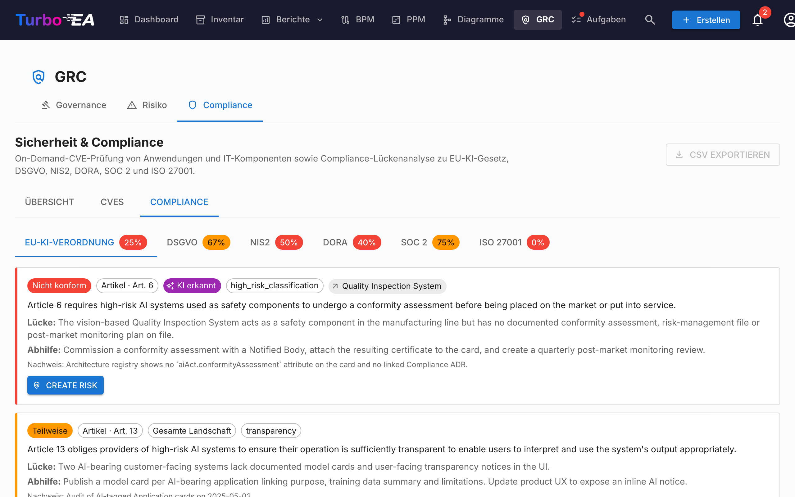

# Compliance

Der **Compliance**-Reiter des [GRC-Moduls](grc.md) unter `/grc?tab=compliance` ist ein **Register mit zwei Quellen**: jeder Befund wurde entweder von einer Reviewerin erfasst oder von einem KI-Scan gegen eine Regulierung erzeugt — und beide Arten von Befunden leben und werden Seite an Seite in derselben Tabelle triagiert.




!!! note
    Sechs Regulierungen sind standardmäßig aktiviert — **EU AI Act**, **GDPR**, **NIS2**, **DORA**, **SOC 2**, **ISO/IEC 27001**. Administratoren können sie aktivieren, deaktivieren oder benutzerdefinierte Regulierungen hinzufügen (z.B. HIPAA, interne Richtlinien-Frameworks) unter [**Administration → Metamodell → Regulierungen**](../admin/metamodel.md#compliance-regulations).

## Zwei Wege, wie Befunde im Register landen

| Quelle | Wer erstellt sie | Wann verwenden |
|--------|------------------|----------------|
| **Manuell** | Eine Nutzerin mit `security_compliance.manage` klickt **+ Neuer Befund** in der Compliance-Tabelle | Audit-getriebene Verpflichtungen, extern gemeldete Lücken, Drittparteien-Attestierungen, alles was getrackt werden soll und ein LLM-Scan nicht auftauchen würde |
| **KI-Scan** (TurboLens) | Eine Nutzerin mit `security_compliance.manage` löst einen Scan aus der Compliance-Symbolleiste aus | Periodische Landschafts-Lückenanalyse gegen die aktivierten Regulierungen |

Die zwei Wege teilen dasselbe Datenmodell und denselben Lebenszyklus. Ein Scan löscht oder überschreibt niemals einen manuellen Befund, und ein manuell erfasster Befund kann zu einem Risiko überführt werden, von einem Risiko-Schluss zurückpropagiert und bulk-aktioniert werden — exakt wie ein KI-erkannter.

## Einen Befund manuell erfassen

Klick **+ Neuer Befund** in der Compliance-Symbolleiste, um den Erstellungsdialog zu öffnen. Pflichtfelder:

| Feld | Beschreibung |
|------|--------------|
| **Regulierung** | Wähle eine der aktivierten Regulierungen. Bestimmt den Artikel-Picker. |
| **Artikel** | Freitext-Bezeichner (`Art. 6`, `§ 32`, `Anhang II`, …). Wird beim Speichern normalisiert, damit Re-Scans die Zeile nicht duplizieren. |
| **Anforderung** | Die Klausel oder Kontrolle, die du verfolgst. |
| **Status** | `new`, `in_review`, `mitigated`, `verified`, `accepted`, `not_applicable`, `risk_tracked`. Default `new`. |
| **Schweregrad** | `low`, `medium`, `high`, `critical`. |
| **Lücke** | Beschreibung der Lücke oder Beobachtung. |
| **Nachweis** | Belege, Audit-Notizen, Links. |
| **Empfohlene Behebung** | Vorgeschlagene Behebung. Wird als Seed für die Mitigationsaufgabe verwendet, wenn der Befund später zu einem Risiko überführt wird. |
| **Verknüpfte Karte** | Optional — den Befund auf eine bestimmte Anwendung, IT-Komponente oder andere Karte beziehen. |
| **Verknüpftes Risiko** | Optional — vorab mit einem bestehenden Risiko verknüpfen, falls eines die Lücke bereits verfolgt. |

`security_compliance.manage` ist erforderlich, um Befunde zu erstellen, zu bearbeiten, stillzulegen oder bulk-zu-aktionieren. `security_compliance.view` reicht, um das Register zu lesen und vom kartenseitigen Compliance-Reiter zu triagieren.

## Einen KI-Scan ausführen

!!! info "KI für Scans erforderlich, nicht für manuelle Befunde"
    Manuelle Befunde funktionieren in jeder Bereitstellung. KI-Scans benötigen einen kommerziellen KI-Provider (Anthropic Claude, OpenAI, DeepSeek oder Google Gemini), konfiguriert in den [KI-Einstellungen](../admin/ai.md).

Markiere die einzubeziehenden Regulierungen und klicke **Compliance-Scan starten**. Der Scan läuft im Hintergrund als [TurboLens-Analyselauf](turbolens.md#analysis-history):

1. **Karten laden** — der aktuelle Landschafts-Snapshot wird gezogen.
2. **Semantische KI-Erkennung** — Name, Beschreibung, Anbieter und verknüpfte Schnittstellen jeder Karte werden auf KI-/ML-Signale geprüft (LLMs, Empfehlungs-Engines, Computer Vision, Betrugs- oder Kredit-Scoring, Chatbots, Predictive Analytics, Anomalieerkennung). Hier markierte Karten tragen einen **KI-erkannt**-Chip in der Tabelle, selbst wenn ihr Subtyp nicht `AI Agent` / `AI Model` ist.
3. **Pro-Regulierungs-Prüfung** — der konfigurierte LLM führt die Regulierungs-Checkliste gegen die im Scope befindlichen Karten aus.

Die Seite rendert eine live phasenbewusste Fortschrittsleiste. **Das Neuladen der Seite unterbricht den Scan nicht** — die Hintergrundaufgabe läuft serverseitig weiter, und die UI heftet die Poll-Schleife beim Mount via `/turbolens/security/active-runs` neu an.

Der Scan ersetzt nur Befunde für die Regulierungen, die du gescoped hast. Befunde anderer Regulierungen bleiben intakt.

## Wie manuelle und KI-Befunde koexistieren

Compliance-Befunde werden per `(scope, card, regulation, normalised_article)` upserted. Dieser Schlüssel verhindert Kollisionen zwischen den beiden Quellen:

- Ein **manueller Befund**, den der nächste KI-Scan ebenfalls erzeugen würde, wird gegen die bestehende Zeile abgeglichen — deine Nachweise, Prüfnotizen und Status bleiben erhalten; nur der LLM-Text für Lücke / Behebung wird aufgefrischt, falls er sich geändert hat.
- Ein **KI-erkannter Befund**, den der nächste Lauf nicht mehr meldet, wird **nicht gelöscht**. Er wird als `auto_resolved=true` markiert und standardmäßig ausgeblendet, sodass seine Historie und jeder Rückverweis auf ein promotetes Risiko erhalten bleibt.
- Das **KI-Verdikt der Nutzerin** auf einer Karte (`hasAiFeatures = true / false`) bleibt ebenfalls bestehen. Wenn du die KI-tragende Klassifizierung des LLM bestätigst oder ablehnst, überschreibt diese Entscheidung den Detektor in nachfolgenden Scans — LLM-Drift kann den Scope eines Befunds nicht stillschweigend ändern.

## Status-Workflow

Befunde haben einen 4-Zustands-Hauptpfad mit 3 Seitenzweigen, gerendert als horizontale Phasen-Timeline in der Detail-Schublade:

```
new → in_review → mitigated → verified
                      ↘ accepted          (Seitenzweig, Begründung erforderlich)
                      ↘ not_applicable    (Seitenzweig, Scope-Review)
                      ↘ risk_tracked      (automatisch bei Überführung in Risiko gesetzt)
```

Übergänge sind auf Nutzer mit `security_compliance.manage` beschränkt. Die Engine erzwingt Übergänge serverseitig und lehnt illegale Bewegungen mit klarem Fehler ab.

`risk_tracked` wird nie manuell gesetzt — es wird automatisch geschrieben, wenn du **Risiko erstellen** auf einem Befund klickst, und vom Risiko-Rückpropagations-Engine geleert, wenn das verknüpfte Risiko schließt.

## Befund ins Risikoregister überführen

Jede Befund-Karte (manuell oder KI-erkannt) trägt eine **Risiko erstellen**-Primäraktion. Klick darauf öffnet den geteilten Risiko-Erstellungs-Dialog mit Titel, Beschreibung, Kategorie, Wahrscheinlichkeit, Impact und betroffener Karte **aus dem Befund vorbefüllt**. Du kannst jedes Feld vor dem Absenden bearbeiten, einen **Eigentümer** zuweisen und ein **Zielauflösungsdatum** wählen.

Beim Absenden flippt die Zeile des Befunds zu **Risiko R-000123 öffnen**, sodass der Link sichtbar bleibt. Die Aktion ist **idempotent** — ein erneuter Klick navigiert zum bestehenden Risiko statt ein Duplikat zu erstellen.

Eine einmalige Mitigationsaufgabe wird automatisch auf dem neuen Risiko gespawnt, geseedet aus dem **Empfohlene Behebung**-Text des Befunds — die Lückenanalyse verwandelt sich also direkt in umsetzbare, eigentümerbasierte Arbeit. Siehe [Risikoregister → Aus einem TurboLens-Compliance-Befund überführen](risks.md#promoting-from-a-turbolens-compliance-finding) für den vollen Lebenszyklus und wie Eigentümer-Zuweisung ein Folge-Todo + Glocken-Benachrichtigung erzeugt.

Wenn das verknüpfte Risiko später `mitigated`, `monitoring`, `closed` oder `accepted` erreicht (oder gelöscht wird), bewegt die Rückpropagations-Engine automatisch jeden verknüpften Compliance-Befund in den passenden Zustand (`mitigated`, `verified`, `accepted` oder zurück zu `in_review`). Die auf dem Risiko erfasste Akzeptanzbegründung wird in die Prüfnotiz des Befunds gespiegelt, damit der Audit-Pfad konsistent bleibt.

## Tabelle, Filterung und Bulk-Aktionen

Die Compliance-Tabelle spiegelt die [Inventar](inventory.md)-Tabelle: Filter-Sidebar mit Spaltensichtbarkeits-Schaltern, persistierte Sortierung, Volltextsuche und eine Detail-Schublade pro Befund.

Mit `security_compliance.manage` exponiert die Tabelle filter-bewusste Mehrfachauswahl. Tick die Header-Checkbox, um jede Zeile auszuwählen, die den aktiven Filtern entspricht, und nutze dann die fixierte Symbolleiste:

- **Entscheidung bearbeiten** — Batch-Transition jeden ausgewählten Befund in einen gewählten Zustand (z.B. einen Schwung Befunde als `not_applicable` markieren nach einer Scope-Überprüfung). Illegale Übergänge werden pro Zeile in einer Teil-Erfolg-Zusammenfassung gemeldet statt die gesamte Batch fehlschlagen zu lassen.
- **Löschen** — Befunde permanent entfernen (verwendet, um Befunde aus einer seitdem deaktivierten Regulierung aufzuräumen).

Die Überführung in ein Risiko bleibt eine Einzelzeilen-Aktion — Bulk-Promotion wird bewusst nicht angeboten, um die Kontext-Erfassung pro Befund zu bewahren.

## Übersichts-KPIs

Der Compliance-Reiter zeigt zudem oben auf der Seite einen **Gesamt-Compliance-KPI** und eine kompakte **Pro-Regulierungs-Heatmap**. Klick auf eine Zelle der Heatmap, um in die Tabelle zu drillen, gescoped auf diese Regulierung × Status-Kombination.

## Compliance auf einer einzelnen Karte


Karten, die im Scope eines beliebigen Befunds liegen, exponieren ebenfalls einen **Compliance**-Reiter auf ihrer Detailseite (durch `security_compliance.view` gesteuert). Er listet jeden mit der Karte verknüpften Befund mit denselben Aktionen Acknowledge / Accept / **Risiko erstellen** / **Risiko öffnen** wie die GRC-Ansicht — sodass ein Application Owner seine eigenen Befunde triagieren kann, ohne die Karte zu verlassen. Dieselbe Auto-Ausblende-Regel gilt für den **Risiken**-Reiter in den Kartendetails: beide Reiter erscheinen nur, wenn die Karte tatsächlich verknüpfte Einträge hat, sodass Karten ohne GRC-Aktivität keine leeren Reiter mitschleppen.

## Demo-Daten

`SEED_DEMO=true` befüllt eine handkuratierte Sammlung von Beispiel-Compliance-Befunden (über alle sechs eingebauten Regulierungen und einen Mix aus Lebenszyklus-Zuständen) gegen die NexaTech-Demo-Karten, sodass der Reiter ohne konfigurierten KI-Provider sofort einsatzbereit ist.

## Berechtigungen

| Berechtigung | Standardrollen |
|--------------|----------------|
| `security_compliance.view` | admin, bpm_admin, member, viewer |
| `security_compliance.manage` | admin |

`security_compliance.view` regelt den Lesezugriff auf das Register, den kartenseitigen Compliance-Reiter und die Übersichts-KPIs. `security_compliance.manage` ist erforderlich, um Befunde zu erstellen oder zu bearbeiten, ihren Status zu ändern, Scans auszuführen, bulk-zu-aktionieren, zu einem Risiko zu überführen oder einen Befund zu löschen.
