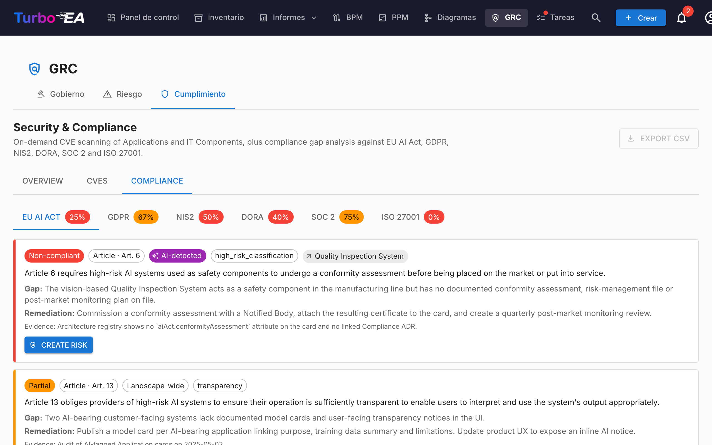

# Cumplimiento

La pestaña **Cumplimiento** del [módulo GRC](grc.md) en `/grc?tab=compliance` es un **registro de doble fuente**: cada hallazgo o bien fue redactado por un revisor o fue producido por un escaneo IA contra una regulación — y ambos tipos de hallazgos viven y se triagean lado a lado en la misma cuadrícula.




!!! note
    Seis regulaciones vienen habilitadas por defecto — **EU AI Act**, **RGPD**, **NIS2**, **DORA**, **SOC 2**, **ISO/IEC 27001**. Los administradores pueden habilitar, deshabilitar o añadir regulaciones personalizadas (p.ej. HIPAA, frameworks de política interna) bajo [**Administración → Metamodelo → Regulaciones**](../admin/metamodel.md#compliance-regulations).

## Dos formas en que los hallazgos llegan al registro

| Fuente | Quién lo crea | Cuándo usar |
|--------|---------------|-------------|
| **Manual** | Un usuario con `security_compliance.manage` hace clic en **+ Nuevo hallazgo** en la cuadrícula de Cumplimiento | Obligaciones derivadas de auditorías, brechas reportadas externamente, atestaciones de terceros, cualquier cosa que se quiera rastrear que un escaneo LLM no haría aflorar |
| **Escaneo IA** (TurboLens) | Un usuario con `security_compliance.manage` dispara un escaneo desde la barra de herramientas de Cumplimiento | Análisis de brechas periódico del paisaje contra las regulaciones habilitadas |

Las dos vías comparten el mismo modelo de datos y ciclo de vida. Un escaneo nunca borra ni anula un hallazgo manual, y un hallazgo introducido manualmente puede ser promovido a un Riesgo, propagado de vuelta desde un cierre de Riesgo y bulk-actionado exactamente como uno detectado por IA.

## Crear un hallazgo manualmente

Haz clic en **+ Nuevo hallazgo** en la barra de herramientas de Cumplimiento para abrir el diálogo de creación. Campos requeridos:

| Campo | Descripción |
|-------|-------------|
| **Regulación** | Elige una de las regulaciones habilitadas. Determina el selector de artículo. |
| **Artículo** | Identificador de texto libre (`Art. 6`, `§ 32`, `Anexo II`, …). Normalizado al guardar para que los re-escaneos no dupliquen la fila. |
| **Requisito** | La cláusula o control que estás rastreando. |
| **Estado** | `new`, `in_review`, `mitigated`, `verified`, `accepted`, `not_applicable`, `risk_tracked`. Por defecto `new`. |
| **Severidad** | `low`, `medium`, `high`, `critical`. |
| **Brecha** | Descripción de la brecha u observación. |
| **Evidencia** | Evidencia de respaldo, notas de auditoría, enlaces. |
| **Remediación** | Remediación sugerida. Usada como semilla para la tarea de mitigación si luego promueves el hallazgo a un Riesgo. |
| **Tarjeta vinculada** | Opcional — limitar el hallazgo a una Aplicación, Componente IT u otra tarjeta específica. |
| **Riesgo vinculado** | Opcional — pre-vincular a un Riesgo existente si uno ya rastrea esta brecha. |

`security_compliance.manage` es requerido para crear, editar, retirar o bulk-actionar hallazgos. `security_compliance.view` basta para leer el registro y triagear desde la pestaña Cumplimiento a nivel de tarjeta.

## Ejecutar un escaneo IA

!!! info "IA requerida para escaneos, no para hallazgos manuales"
    Los hallazgos manuales funcionan en cualquier despliegue. Los escaneos IA requieren un proveedor IA comercial (Anthropic Claude, OpenAI, DeepSeek o Google Gemini) configurado en [Configuración IA](../admin/ai.md).

Marca las regulaciones a incluir y haz clic en **Ejecutar escaneo de cumplimiento**. El escaneo corre en segundo plano como un [análisis TurboLens](turbolens.md#analysis-history):

1. **Cargando tarjetas** — se obtiene el snapshot vivo del paisaje.
2. **Detección IA semántica** — el nombre, descripción, proveedor e interfaces vinculadas de cada tarjeta se revisan en busca de señales IA / ML (LLMs, motores de recomendación, visión por computador, scoring de fraude o crédito, chatbots, analítica predictiva, detección de anomalías). Las tarjetas marcadas aquí llevan un chip **IA detectada** en la cuadrícula incluso cuando su subtipo no es `AI Agent` / `AI Model`.
3. **Verificación por regulación** — el LLM configurado ejecuta la checklist de la regulación contra las tarjetas en alcance.

La página renderiza una barra de progreso live consciente de las fases. **Refrescar la página no interrumpe el escaneo** — la tarea de fondo sigue corriendo en el servidor, y la UI re-engancha el bucle de poll al montaje vía `/turbolens/security/active-runs`.

El escaneo solo reemplaza hallazgos para las regulaciones que has scopeado. Los hallazgos de otras regulaciones quedan intactos.

## Cómo coexisten los hallazgos manuales e IA

Los hallazgos de cumplimiento se upsertean por `(scope, card, regulation, normalised_article)`. Esa clave evita colisiones entre las dos fuentes:

- Un **hallazgo manual** que el próximo escaneo IA también produciría se reconcilia con la fila existente — tu evidencia, notas de revisión y estado sobreviven; solo se refresca el texto LLM de brecha / remediación si cambió.
- Un **hallazgo detectado por IA** que la próxima pasada ya no reporta **no se elimina**. Se marca como `auto_resolved=true` y se oculta por defecto, de modo que su historial y cualquier enlace de vuelta a un Riesgo promovido queden intactos.
- El **veredicto IA del usuario** sobre una tarjeta (`hasAiFeatures = true / false`) también persiste. Si confirmas o rechazas la clasificación IA-bearing del LLM, esa decisión sobrescribe al detector en escaneos posteriores — la deriva LLM no puede re-scopear silenciosamente un hallazgo.

## Flujo de estados

Los hallazgos tienen un camino principal de 4 estados con 3 ramas laterales, renderizado como una línea de tiempo horizontal de fases en el panel de detalle:

```
new → in_review → mitigated → verified
                      ↘ accepted          (rama lateral, requiere justificación)
                      ↘ not_applicable    (rama lateral, revisión de alcance)
                      ↘ risk_tracked      (establecido automáticamente al promover a Riesgo)
```

Las transiciones están restringidas a usuarios con `security_compliance.manage`. El motor impone las transiciones del lado servidor y rechaza movimientos ilegales con un error claro.

`risk_tracked` nunca se establece a mano — se escribe automáticamente cuando haces clic en **Crear riesgo** en un hallazgo, y es limpiado por el motor de retropropagación del Riesgo cuando el Riesgo vinculado se cierra.

## Promover un hallazgo al Registro de riesgos

Cada tarjeta de hallazgo (manual o detectada por IA) lleva una acción primaria **Crear riesgo**. Hacer clic abre el diálogo compartido de creación de riesgo con título, descripción, categoría, probabilidad, impacto y tarjeta afectada **prerrellenados desde el hallazgo**. Puedes editar cualquier campo antes de enviar, asignar un **propietario** y elegir una **fecha objetivo de resolución**.

Al enviar, la fila del hallazgo cambia a **Abrir riesgo R-000123** para que el enlace permanezca visible. La acción es **idempotente** — un nuevo clic navega al riesgo existente en vez de crear un duplicado.

Una tarea de mitigación one-shot se spawnea automáticamente en el nuevo Riesgo, sembrada desde el texto de **Remediación** del hallazgo — el análisis de brechas se convierte así directamente en trabajo accionable y con dueño. Consulta [Registro de riesgos → Promover desde un hallazgo de cumplimiento TurboLens](risks.md#promoting-from-a-turbolens-compliance-finding) para el ciclo de vida completo y cómo la asignación de propietario crea un Todo + notificación de campana de seguimiento.

Cuando el Riesgo vinculado alcanza más tarde `mitigated`, `monitoring`, `closed` o `accepted` (o se borra), el motor de retropropagación mueve automáticamente cada hallazgo de cumplimiento vinculado al estado correspondiente (`mitigated`, `verified`, `accepted` o de vuelta a `in_review`). La justificación de aceptación capturada en el Riesgo se refleja en la nota de revisión del hallazgo para mantener consistente la pista de auditoría.

## Cuadrícula, filtrado y acciones en lote

La cuadrícula de Cumplimiento refleja la de [Inventario](inventory.md): barra lateral de filtros con conmutadores de visibilidad de columnas, orden persistido, búsqueda de texto completo y un panel de detalle por hallazgo.

Cuando se concede `security_compliance.manage`, la cuadrícula expone selección múltiple consciente de filtros. Marca la casilla del encabezado para seleccionar todas las filas que coincidan con los filtros activos y luego usa la barra de herramientas fija:

- **Editar decisión** — transición en lote de cada hallazgo seleccionado a un estado elegido (p.ej. marcar un grupo de hallazgos como `not_applicable` tras una revisión de alcance). Las transiciones ilegales se reportan por fila en un resumen de éxito parcial en lugar de hacer fracasar todo el lote.
- **Eliminar** — eliminar hallazgos permanentemente (usado para limpiar hallazgos de una regulación que has deshabilitado desde entonces).

La promoción a Riesgo sigue siendo una acción de fila única — la promoción en lote no se ofrece intencionalmente para preservar la captura de contexto por hallazgo.

## KPIs de la vista general

La pestaña Cumplimiento también muestra un **KPI global de cumplimiento** en la parte superior y una **heatmap por regulación** compacta. Haz clic en cualquier celda de la heatmap para drillar a la cuadrícula scopeada a esa combinación regulación × estado.

## Cumplimiento en una sola ficha


Las fichas dentro del alcance de cualquier hallazgo también muestran una pestaña **Cumplimiento** en su página de detalle (gobernada por `security_compliance.view`). Lista cada hallazgo actualmente vinculado a la ficha con las mismas acciones Reconocer / Aceptar / **Crear riesgo** / **Abrir riesgo** que la vista GRC — de modo que un Application Owner pueda clasificar sus propios hallazgos sin salir de la ficha. La misma regla de ocultamiento automático se aplica a la pestaña **Riesgos** en el detalle de la ficha: ambas pestañas solo aparecen cuando la ficha realmente tiene elementos vinculados, de modo que las fichas sin actividad GRC no arrastran pestañas vacías.

## Datos de demo

`SEED_DEMO=true` puebla un conjunto curado a mano de hallazgos de cumplimiento de ejemplo (a través de las seis regulaciones integradas y un mix de estados de ciclo de vida) contra las tarjetas de demo NexaTech, de modo que la pestaña sea utilizable de inmediato sin un proveedor IA configurado.

## Permisos

| Permiso | Roles por defecto |
|---------|-------------------|
| `security_compliance.view` | admin, bpm_admin, member, viewer |
| `security_compliance.manage` | admin |

`security_compliance.view` rige el acceso de lectura al registro, la pestaña Cumplimiento por tarjeta y los KPIs de la vista general. `security_compliance.manage` es necesario para crear o editar hallazgos, cambiar su estado, ejecutar escaneos, bulk-actionar, promover a un Riesgo o eliminar un hallazgo.
