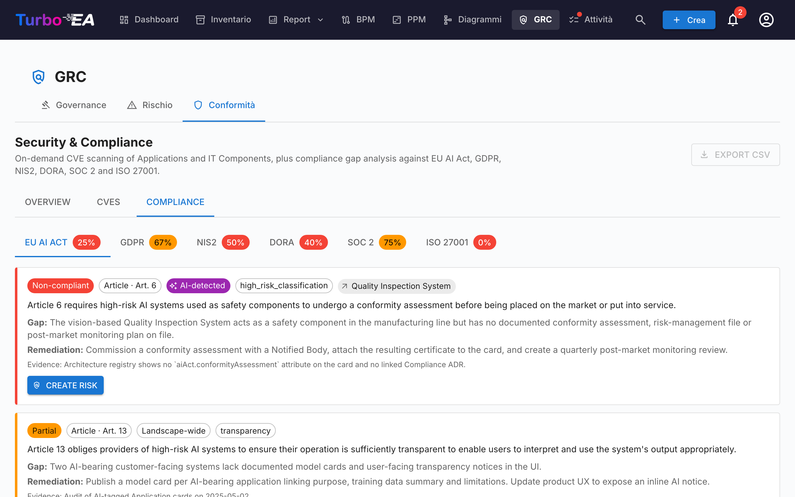

# Conformità

La scheda **Conformità** del [modulo GRC](grc.md) all'indirizzo `/grc?tab=compliance` è un **registro a doppia fonte**: ogni rilevazione è stata scritta da un revisore oppure prodotta da una scansione IA contro una regolamentazione — ed entrambi i tipi di rilevazione convivono e vengono triagiati fianco a fianco nella stessa griglia.




!!! note
    Sei regolamentazioni sono abilitate per impostazione predefinita — **EU AI Act**, **GDPR**, **NIS2**, **DORA**, **SOC 2**, **ISO/IEC 27001**. Gli amministratori possono abilitare, disabilitare o aggiungere regolamentazioni personalizzate (es. HIPAA, framework di policy interne) sotto [**Amministrazione → Metamodello → Regolamentazioni**](../admin/metamodel.md#compliance-regulations).

## Due modi in cui le rilevazioni atterrano nel registro

| Fonte | Chi la crea | Quando usarla |
|-------|-------------|---------------|
| **Manuale** | Un utente con `security_compliance.manage` clicca **+ Nuova rilevazione** nella griglia Conformità | Obblighi derivanti da audit, lacune segnalate esternamente, attestazioni di terze parti, qualsiasi cosa che si vuole tracciare che una scansione LLM non farebbe emergere |
| **Scansione IA** (TurboLens) | Un utente con `security_compliance.manage` avvia una scansione dalla toolbar Conformità | Analisi periodica delle lacune del paesaggio contro le regolamentazioni abilitate |

I due percorsi condividono lo stesso modello dati e ciclo di vita. Una scansione non cancella né sovrascrive mai una rilevazione manuale, e una rilevazione inserita manualmente può essere promossa a un Rischio, retro-propagata dalla chiusura di un Rischio e bulk-aktionata esattamente come una rilevata da IA.

## Creare una rilevazione manualmente

Clicca **+ Nuova rilevazione** nella toolbar Conformità per aprire il dialogo di creazione. Campi richiesti:

| Campo | Descrizione |
|-------|-------------|
| **Regolamentazione** | Scegli una delle regolamentazioni abilitate. Determina il selettore di articolo. |
| **Articolo** | Identificatore in testo libero (`Art. 6`, `§ 32`, `Allegato II`, …). Normalizzato al salvataggio così che le re-scansioni non duplichino la riga. |
| **Requisito** | La clausola o controllo che stai tracciando. |
| **Stato** | `new`, `in_review`, `mitigated`, `verified`, `accepted`, `not_applicable`, `risk_tracked`. Default `new`. |
| **Severità** | `low`, `medium`, `high`, `critical`. |
| **Lacuna** | Descrizione della lacuna o osservazione. |
| **Evidenza** | Evidenza di supporto, note di audit, link. |
| **Rimedio** | Rimedio suggerito. Usato come seme per il task di mitigazione se in seguito promuovi la rilevazione a un Rischio. |
| **Card collegata** | Opzionale — restringere la rilevazione a una specifica Applicazione, Componente IT o altra card. |
| **Rischio collegato** | Opzionale — pre-collegare a un Rischio esistente se uno già traccia questa lacuna. |

`security_compliance.manage` è richiesto per creare, modificare, ritirare o bulk-azionare rilevazioni. `security_compliance.view` basta per leggere il registro e triagiare dalla scheda Conformità a livello di card.

## Eseguire una scansione IA

!!! info "IA richiesta per le scansioni, non per le rilevazioni manuali"
    Le rilevazioni manuali funzionano in qualsiasi deployment. Le scansioni IA richiedono un provider IA commerciale (Anthropic Claude, OpenAI, DeepSeek o Google Gemini) configurato nelle [Impostazioni IA](../admin/ai.md).

Spunta le regolamentazioni da includere e clicca **Avvia scansione di conformità**. La scansione gira in background come un'[esecuzione di analisi TurboLens](turbolens.md#analysis-history):

1. **Caricamento delle card** — viene prelevato lo snapshot live del paesaggio.
2. **Rilevamento IA semantico** — nome, descrizione, fornitore e interfacce collegate di ogni card vengono controllati per segnali IA / ML (LLM, motori di raccomandazione, computer vision, scoring di frode o credito, chatbot, analitica predittiva, rilevamento di anomalie). Le card flaggate qui portano un chip **IA-rilevata** nella griglia anche quando il loro sottotipo non è `AI Agent` / `AI Model`.
3. **Verifica per regolamentazione** — l'LLM configurato esegue la checklist della regolamentazione contro le card in scope.

La pagina rende una barra di progresso live consapevole delle fasi. **Ricaricare la pagina non interrompe la scansione** — il task di background continua a girare lato server e l'UI ri-aggancia il loop di polling al mount via `/turbolens/security/active-runs`.

La scansione sostituisce solo le rilevazioni delle regolamentazioni che hai scopeato. Le rilevazioni di altre regolamentazioni rimangono intatte.

## Come coesistono rilevazioni manuali e IA

Le rilevazioni di conformità vengono upserted per `(scope, card, regulation, normalised_article)`. Quella chiave evita collisioni tra le due fonti:

- Una **rilevazione manuale** che la prossima scansione IA produrrebbe anch'essa viene riconciliata con la riga esistente — la tua evidenza, le note di revisione e lo stato sopravvivono; solo il testo LLM di lacuna / rimedio viene rinfrescato se è cambiato.
- Una **rilevazione rilevata da IA** che il prossimo passaggio non riporta più **non viene cancellata**. Viene marcata come `auto_resolved=true` e nascosta per default, in modo che la sua storia e qualsiasi back-link a un Rischio promosso rimangano intatti.
- Il **verdetto IA dell'utente** su una card (`hasAiFeatures = true / false`) persiste anch'esso. Se confermi o rigetti la classificazione IA-bearing dell'LLM, quella decisione sovrascrive il rilevatore nelle scansioni successive — la deriva LLM non può silenziosamente ri-scopeare una rilevazione.

## Workflow di stato

Le rilevazioni hanno un percorso principale a 4 stati con 3 rami laterali, reso come una timeline orizzontale di fasi nel pannello di dettaglio:

```
new → in_review → mitigated → verified
                      ↘ accepted          (ramo laterale, motivazione richiesta)
                      ↘ not_applicable    (ramo laterale, revisione di scope)
                      ↘ risk_tracked      (settato automaticamente alla promozione in Rischio)
```

Le transizioni sono limitate agli utenti con `security_compliance.manage`. Il motore impone le transizioni lato server e rifiuta mosse illegali con un errore chiaro.

`risk_tracked` non viene mai settato a mano — viene scritto automaticamente quando clicchi **Crea rischio** su una rilevazione, e pulito dal motore di retro-propagazione del Rischio quando il Rischio collegato si chiude.

## Promuovere una rilevazione al Registro dei rischi

Ogni card di rilevazione (manuale o rilevata da IA) porta un'azione primaria **Crea rischio**. Cliccarla apre il dialogo condiviso di creazione rischio con titolo, descrizione, categoria, probabilità, impatto e card interessata **precompilati dalla rilevazione**. Puoi modificare qualsiasi campo prima di inviare, assegnare un **proprietario** e scegliere una **data target di risoluzione**.

All'invio, la riga della rilevazione passa a **Apri rischio R-000123** così il link rimane visibile. L'azione è **idempotente** — un nuovo clic naviga al rischio esistente invece di crearne un duplicato.

Un task di mitigazione one-shot viene automaticamente spawnato sul nuovo Rischio, seminato dal testo **Rimedio** della rilevazione — l'analisi della lacuna si trasforma così direttamente in lavoro accionabile e di proprietà. Vedi [Registro dei rischi → Promozione da una rilevazione di conformità TurboLens](risks.md#promoting-from-a-turbolens-compliance-finding) per il ciclo di vita completo e come l'assegnazione del proprietario crea un Todo + notifica di campanello di follow-up.

Quando il Rischio collegato raggiunge in seguito `mitigated`, `monitoring`, `closed` o `accepted` (o viene cancellato), il motore di retro-propagazione muove automaticamente ogni rilevazione di conformità collegata allo stato corrispondente (`mitigated`, `verified`, `accepted` o di nuovo a `in_review`). La motivazione di accettazione catturata sul Rischio viene specchiata nella nota di revisione della rilevazione per mantenere la traccia di audit consistente.

## Griglia, filtri e azioni in batch

La griglia Conformità rispecchia quella di [Inventario](inventory.md): barra laterale di filtri con switch di visibilità delle colonne, ordinamento persistito, ricerca full-text e un pannello di dettaglio per rilevazione.

Quando `security_compliance.manage` è concesso, la griglia espone selezione multipla consapevole dei filtri. Spunta la checkbox dell'header per selezionare ogni riga che corrisponda ai filtri attivi e poi usa la toolbar fissa:

- **Modifica decisione** — transizione in batch di ogni rilevazione selezionata a uno stato scelto (es. marcare un gruppo di rilevazioni come `not_applicable` dopo una revisione di scope). Le transizioni illegali vengono superficiate per riga in un riepilogo di successo parziale invece di far fallire l'intero batch.
- **Elimina** — rimuovere permanentemente rilevazioni (usato per ripulire rilevazioni da una regolamentazione che da allora hai disabilitato).

La promozione a Rischio rimane un'azione su singola riga — la promozione in batch non è offerta intenzionalmente per preservare la cattura del contesto per rilevazione.

## KPI della panoramica

La scheda Conformità mostra anche un **KPI complessivo di conformità** in cima alla pagina e una **heatmap per regolamentazione** compatta. Clicca qualsiasi cella della heatmap per drillare nella griglia scopeata a quella combinazione regolamentazione × stato.

## Conformità su una singola card


Le card in scope di qualsiasi rilevazione espongono anche una scheda **Conformità** sulla loro pagina di dettaglio (governata da `security_compliance.view`). Elenca ogni rilevazione attualmente collegata alla card con le stesse azioni Riconosci / Accetta / **Crea rischio** / **Apri rischio** della vista GRC — in modo che un Application Owner possa triagiare le proprie rilevazioni senza lasciare la card. La stessa regola di auto-nascondimento si applica alla scheda **Rischi** nel dettaglio della card: entrambe le schede appaiono solo quando la card ha effettivamente elementi collegati, in modo che le card senza attività GRC non si trascinino schede vuote.

## Dati demo

`SEED_DEMO=true` popola un set curato a mano di rilevazioni di conformità di esempio (attraverso tutte e sei le regolamentazioni integrate e un mix di stati di ciclo di vita) contro le card demo NexaTech, in modo che la scheda sia utilizzabile fin da subito senza un provider IA configurato.

## Permessi

| Permesso | Ruoli predefiniti |
|----------|-------------------|
| `security_compliance.view` | admin, bpm_admin, member, viewer |
| `security_compliance.manage` | admin |

`security_compliance.view` regola l'accesso in lettura al registro, alla scheda Conformità per card e ai KPI della panoramica. `security_compliance.manage` è necessario per creare o modificare rilevazioni, cambiarne lo stato, eseguire scansioni, bulk-azionare, promuovere a un Rischio o cancellare una rilevazione.
