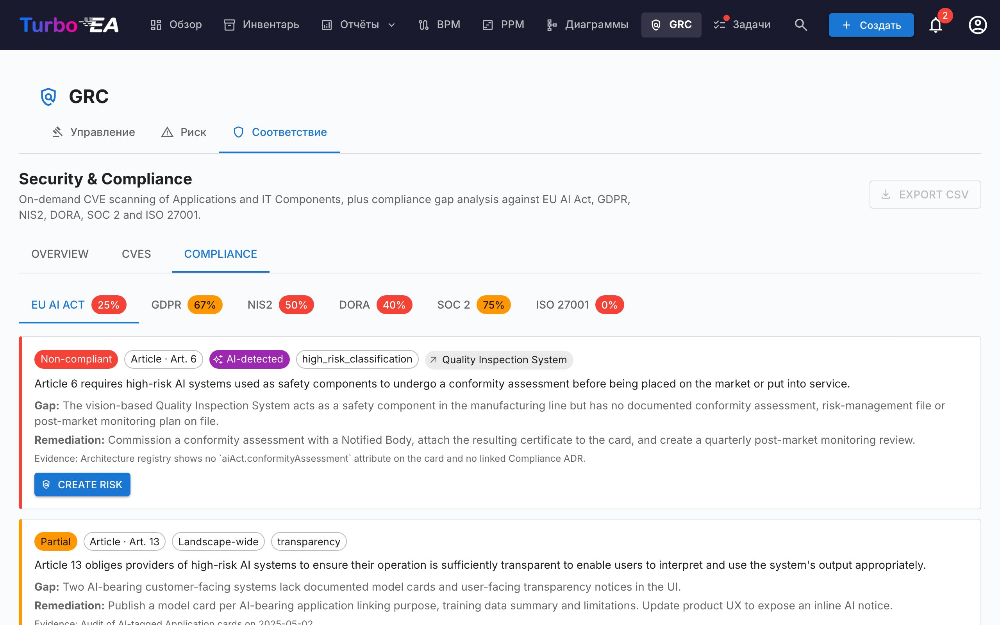

# Соответствие

Вкладка **Соответствие** [модуля GRC](grc.md) по адресу `/grc?tab=compliance` — это **реестр с двойным источником**: каждая находка либо была создана рецензентом, либо произведена AI-сканированием против регламента — и оба типа находок живут и сортируются бок о бок в одной сетке.




!!! note
    Шесть регламентов включены по умолчанию — **EU AI Act**, **GDPR**, **NIS2**, **DORA**, **SOC 2**, **ISO/IEC 27001**. Администраторы могут включать, отключать или добавлять пользовательские регламенты (например, HIPAA, внутренние политики) в разделе [**Администрирование → Метамодель → Регламенты**](../admin/metamodel.md#compliance-regulations).

## Два пути попадания находок в реестр

| Источник | Кто создаёт | Когда использовать |
|----------|-------------|--------------------|
| **Ручной** | Пользователь с `security_compliance.manage` нажимает **+ Новая находка** в сетке Соответствия | Обязательства из аудита, внешне отрапортованные пробелы, аттестации третьих сторон — всё, что нужно отслеживать, но что AI-сканирование не выявит |
| **AI-сканирование** (TurboLens) | Пользователь с `security_compliance.manage` запускает сканирование с панели инструментов Соответствия | Периодический анализ пробелов ландшафта по включённым регламентам |

Оба пути разделяют одну и ту же модель данных и жизненный цикл. Сканирование никогда не удаляет и не перезаписывает ручную находку, а введённая вручную находка может быть продвинута в Риск, обратно распространена при закрытии Риска и обработана пакетно так же, как находка, обнаруженная AI.

## Создание находки вручную

Нажмите **+ Новая находка** в панели инструментов Соответствия, чтобы открыть диалог создания. Обязательные поля:

| Поле | Описание |
|------|----------|
| **Регламент** | Выберите один из включённых регламентов. Определяет селектор статьи. |
| **Статья** | Свободно-текстовый идентификатор (`Art. 6`, `§ 32`, `Annex II` и т.д.). Нормализуется при сохранении, чтобы повторные сканирования не дублировали строку. |
| **Требование** | Положение или контроль, который вы отслеживаете. |
| **Статус** | `new`, `in_review`, `mitigated`, `verified`, `accepted`, `not_applicable`, `risk_tracked`. По умолчанию `new`. |
| **Серьёзность** | `low`, `medium`, `high`, `critical`. |
| **Пробел** | Описание пробела или наблюдения. |
| **Доказательство** | Подтверждающие доказательства, заметки аудита, ссылки. |
| **Меры устранения** | Предложенные меры. Используются как зерно для задачи митигации, если потом находка продвигается в Риск. |
| **Связанная карточка** | Опционально — привязать находку к конкретному Приложению, ИТ-Компоненту или другой карточке. |
| **Связанный риск** | Опционально — заранее связать с существующим Риском, если он уже отслеживает этот пробел. |

`security_compliance.manage` необходимо для создания, редактирования, удаления или пакетных действий с находками. `security_compliance.view` достаточно для чтения реестра и сортировки из вкладки Соответствие на уровне карточки.

## Запуск AI-сканирования

!!! info "AI требуется для сканирований, не для ручных находок"
    Ручные находки работают в любом развёртывании. AI-сканирования требуют коммерческого AI-провайдера (Anthropic Claude, OpenAI, DeepSeek или Google Gemini), настроенного в [Настройках AI](../admin/ai.md).

Отметьте регламенты для включения и нажмите **Запустить сканирование соответствия**. Сканирование выполняется в фоне как [запуск анализа TurboLens](turbolens.md#analysis-history):

1. **Загрузка карточек** — извлекается живой снимок ландшафта.
2. **Семантическое AI-обнаружение** — имя, описание, поставщик и связанные интерфейсы каждой карточки проверяются на сигналы AI / ML (LLM, рекомендательные движки, компьютерное зрение, скоринг мошенничества или кредита, чат-боты, предиктивная аналитика, обнаружение аномалий). Карточки, помеченные здесь, несут чип **AI-обнаружено** в сетке, даже если их подтип не `AI Agent` / `AI Model`.
3. **Проверка по регламенту** — настроенный LLM выполняет чек-лист регламента против карточек в области.

Страница отображает живой индикатор прогресса с учётом фаз. **Обновление страницы не прерывает сканирование** — фоновая задача продолжает работать на сервере, а UI повторно подключает цикл опроса при монтировании через `/turbolens/security/active-runs`.

Сканирование заменяет находки только для регламентов, которые вы определили. Находки других регламентов остаются нетронутыми.

## Как сосуществуют ручные и AI-находки

Находки соответствия upsert-ятся по `(scope, card, regulation, normalised_article)`. Этот ключ предотвращает столкновения между двумя источниками:

- **Ручная находка**, которую следующее AI-сканирование тоже произведёт, согласуется с существующей строкой — ваше доказательство, заметки рецензента и статус сохраняются; обновляется только LLM-текст пробела / устранения, если он изменился.
- **AI-обнаруженная находка**, которую следующий проход больше не сообщает, **не удаляется**. Она помечается как `auto_resolved=true` и скрывается по умолчанию, так что её история и любая обратная ссылка на продвинутый Риск сохраняются.
- **AI-вердикт пользователя** по карточке (`hasAiFeatures = true / false`) также сохраняется. Если вы подтверждаете или отклоняете AI-несущую классификацию LLM, это решение перекрывает детектор в последующих сканированиях — дрейф LLM не может молча перерасширить область находки.

## Рабочий процесс статусов

Находки имеют 4-состояний основной путь с 3 боковыми ветвями, отображаемый как горизонтальная фазовая временная шкала в панели деталей:

```
new → in_review → mitigated → verified
                      ↘ accepted          (боковая ветвь, требуется обоснование)
                      ↘ not_applicable    (боковая ветвь, пересмотр области)
                      ↘ risk_tracked      (устанавливается автоматически при продвижении в Риск)
```

Переходы ограничены пользователями с `security_compliance.manage`. Движок принудительно выполняет переходы на сервере и отклоняет незаконные движения с понятной ошибкой.

`risk_tracked` никогда не устанавливается вручную — записывается автоматически, когда вы нажимаете **Создать риск** на находке, и очищается движком обратного распространения Риска при закрытии связанного Риска.

## Продвижение находки в Реестр рисков

Каждая карточка находки (ручная или AI-обнаруженная) несёт первичное действие **Создать риск**. Клик открывает общий диалог создания риска с заголовком, описанием, категорией, вероятностью, воздействием и затронутой карточкой, **предзаполненными из находки**. Вы можете отредактировать любое поле перед отправкой, назначить **владельца** и выбрать **целевую дату разрешения**.

При отправке строка находки переключается на **Открыть риск R-000123**, чтобы ссылка оставалась видимой. Действие **идемпотентно** — повторный клик переходит к существующему риску вместо создания дубликата.

Однократная задача митигации автоматически порождается на новом Риске, засеянная из текста **Меры устранения** находки — анализ пробелов сразу превращается в действенную, прикреплённую работу. См. [Реестр рисков → Продвижение из находки соответствия TurboLens](risks.md#promoting-from-a-turbolens-compliance-finding) для полного жизненного цикла и того, как назначение владельца создаёт последующее Todo + уведомление-колокольчик.

Когда связанный Риск позже достигает `mitigated`, `monitoring`, `closed` или `accepted` (или удаляется), движок обратного распространения автоматически перемещает каждую связанную находку соответствия в соответствующее состояние (`mitigated`, `verified`, `accepted` или обратно в `in_review`). Обоснование принятия, зафиксированное на Риске, отзеркаливается в заметке рецензента находки, чтобы аудиторский след оставался согласованным.

## Сетка, фильтрация и пакетные действия

Сетка Соответствия отражает [сетку Инвентаризации](inventory.md): боковая панель фильтров с переключателями видимости столбцов, сохранённая сортировка, полнотекстовый поиск и панель деталей для каждой находки.

При предоставлении `security_compliance.manage` сетка показывает фильтр-осведомлённый мультивыбор. Отметьте флажок заголовка, чтобы выбрать каждую строку, соответствующую активным фильтрам, затем используйте липкую панель инструментов:

- **Редактировать решение** — пакетный переход каждой выбранной находки в выбранное состояние (например, пометить группу находок как `not_applicable` после пересмотра области). Незаконные переходы выводятся построчно в сводке частичного успеха, а не приводят к сбою всего пакета.
- **Удалить** — окончательно удалить находки (используется для очистки находок регламента, который вы с тех пор отключили).

Продвижение в Риск остаётся действием единичной строки — пакетное продвижение намеренно не предлагается для сохранения захвата контекста по каждой находке.

## KPI обзора

Вкладка Соответствие также показывает **общий KPI соответствия** в верхней части страницы и компактную **тепловую карту по регламенту**. Кликните на любую ячейку тепловой карты, чтобы детализировать в сетке, ограниченной этой комбинацией регламент × статус.

## Соответствие по одной карточке


Карточки в области любой находки также показывают вкладку **Соответствие** на своей странице деталей (управляется `security_compliance.view`). Она перечисляет каждую находку, связанную с карточкой, с теми же действиями Подтвердить / Принять / **Создать риск** / **Открыть риск**, что и вид GRC — так что владелец Приложения может сортировать свои собственные находки, не покидая карточку. Тот же правило авто-скрытия применяется к вкладке **Риски** в деталях карточки: обе вкладки появляются только тогда, когда карточка действительно имеет связанные элементы, чтобы карточки без активности GRC не тянули за собой пустые вкладки.

## Демо-данные

`SEED_DEMO=true` заполняет курируемый вручную набор примеров находок соответствия (по всем шести встроенным регламентам и микс состояний жизненного цикла) против демо-карточек NexaTech, так что вкладка пригодна для использования из коробки без настроенного AI-провайдера.

## Разрешения

| Разрешение | Роли по умолчанию |
|------------|-------------------|
| `security_compliance.view` | admin, bpm_admin, member, viewer |
| `security_compliance.manage` | admin |

`security_compliance.view` управляет доступом для чтения к реестру, вкладке Соответствие по карточке и KPI обзора. `security_compliance.manage` необходимо для создания или редактирования находок, изменения их статуса, запуска сканирований, пакетных действий, продвижения в Риск или удаления находки.
