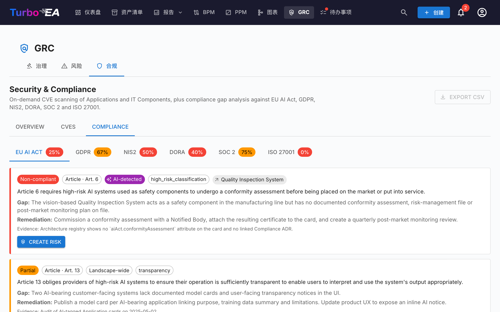

# 合规

[GRC 模块](grc.md)在 `/grc?tab=compliance` 路径下的 **合规** 标签页是一个 **双来源登记册**：每条发现要么由审核员手工撰写，要么由 AI 扫描针对某项法规生成 — 两类发现在同一个网格中并肩生存并被分诊。




!!! note
    六项法规默认启用 — **EU AI Act**、**GDPR**、**NIS2**、**DORA**、**SOC 2**、**ISO/IEC 27001**。管理员可在 [**管理 → 元模型 → 法规**](../admin/metamodel.md#compliance-regulations) 下启用、禁用或新增自定义法规（例如 HIPAA、内部政策框架）。

## 发现进入登记册的两种途径

| 来源 | 谁创建 | 何时使用 |
|------|--------|----------|
| **手工** | 拥有 `security_compliance.manage` 的用户在合规网格点击 **+ 新建发现** | 审计驱动的义务、外部报告的差距、第三方鉴证，任何你想跟踪而 LLM 扫描不会发现的内容 |
| **AI 扫描**（TurboLens） | 拥有 `security_compliance.manage` 的用户从合规工具栏触发扫描 | 针对已启用法规的周期性全景差距分析 |

两条路径共享相同的数据模型和生命周期。扫描永远不会删除或覆盖手工发现，手工录入的发现可以提升为风险、从风险关闭回传，并以与 AI 检测到的发现完全相同的方式进行批量操作。

## 手工创建发现

在合规工具栏中点击 **+ 新建发现** 以打开创建对话框。必填字段：

| 字段 | 说明 |
|------|------|
| **法规** | 从已启用的法规中选择。决定条款选择器。 |
| **条款** | 自由文本标识符（`Art. 6`、`§ 32`、`Annex II` 等）。保存时归一化，重新扫描时不会再产生重复行。 |
| **要求** | 你正在跟踪的条款或控制。 |
| **状态** | `new`、`in_review`、`mitigated`、`verified`、`accepted`、`not_applicable`、`risk_tracked`。默认 `new`。 |
| **严重程度** | `low`、`medium`、`high`、`critical`。 |
| **差距** | 差距或观察的描述。 |
| **证据** | 支持证据、审计备注、链接。 |
| **补救建议** | 建议的补救措施。如果之后将发现提升为风险，会作为缓解任务的种子。 |
| **关联卡片** | 可选 — 将发现限定到特定的应用、IT 组件或其他卡片。 |
| **关联风险** | 可选 — 如果已有一个风险在跟踪该差距，预先关联。 |

创建、编辑、撤回或批量操作发现需要 `security_compliance.manage`。读取登记册以及在卡片级合规标签页中分诊只需 `security_compliance.view`。

## 运行 AI 扫描

!!! info "扫描需要 AI，手工发现不需要"
    手工发现在任何部署中都可用。AI 扫描需要在 [AI 设置](../admin/ai.md) 中配置一个商业 AI 提供商（Anthropic Claude、OpenAI、DeepSeek 或 Google Gemini）。

勾选要包含的法规并点击 **运行合规扫描**。扫描在后台作为 [TurboLens 分析运行](turbolens.md#analysis-history) 执行：

1. **加载卡片** — 拉取全景的实时快照。
2. **语义 AI 检测** — 检查每张卡片的名称、描述、供应商和关联接口中是否存在 AI / ML 信号（LLM、推荐引擎、计算机视觉、欺诈或信用评分、聊天机器人、预测分析、异常检测）。即便子类型不是 `AI Agent` / `AI Model`，此处标记的卡片在网格中也会带有 **AI-检测到** 标签。
3. **按法规检查** — 配置的 LLM 针对作用域内的卡片运行该法规的检查清单。

页面呈现一个阶段感知的实时进度条。**刷新页面不会中断扫描** — 后台任务在服务器端继续运行，UI 在挂载时通过 `/turbolens/security/active-runs` 重新接上轮询循环。

扫描仅替换你界定范围的法规的发现。其他法规的发现保持不变。

## 手工与 AI 发现如何共存

合规发现按 `(scope, card, regulation, normalised_article)` 进行 upsert。该键避免了两个来源之间的冲突：

- 下次 AI 扫描也会产生的 **手工发现** 会与现有行进行协调 — 你的证据、审核备注和状态保留；只有 LLM 的差距 / 补救文本在变化时被刷新。
- 下次扫描不再报告的 **AI 检测到的发现** **不会被删除**。它会被标记为 `auto_resolved=true` 并默认隐藏，使其历史以及到已提升风险的回链保持完好。
- 用户对卡片的 **AI 判定**（`hasAiFeatures = true / false`）也会保留。如果你确认或拒绝 LLM 的 AI 携带分类，该决定将覆盖后续扫描中的检测器 — LLM 漂移不能悄悄地重新界定发现的范围。

## 状态工作流

发现具有 4 状态主路径和 3 个侧分支，在详情抽屉中渲染为水平阶段时间线：

```
new → in_review → mitigated → verified
                      ↘ accepted          （侧分支，需要理由）
                      ↘ not_applicable    （侧分支，范围审查）
                      ↘ risk_tracked      （提升为风险时自动设置）
```

状态转换限定给拥有 `security_compliance.manage` 的用户。引擎在服务器端强制执行转换，对非法移动会以清晰的错误拒绝。

`risk_tracked` 永远不会手动设置 — 它在你点击发现上的 **创建风险** 时自动写入，并在关联风险关闭时由风险回传引擎清除。

## 将发现提升到风险登记册

每张发现卡（手工或 AI 检测到的）都带有一个 **创建风险** 主操作。点击会打开共享的创建风险对话框，标题、描述、类别、概率、影响和受影响卡片 **从该发现中预填**。你可以在提交前编辑任何字段、分配 **负责人** 并选择 **目标解决日期**。

提交后，该发现的行会切换为 **打开风险 R-000123**，使链接保持可见。该操作是 **幂等的** — 再次点击会导航到现有风险而不是创建副本。

一个 one-shot 缓解任务会自动在新风险上生成，从发现的 **补救建议** 文本中播种 — 差距分析就此直接转化为可执行、有归属的工作。详见 [风险登记册 → 从 TurboLens 合规发现提升](risks.md#promoting-from-a-turbolens-compliance-finding) 了解完整生命周期以及负责人分配如何创建后续待办 + 铃铛通知。

当关联风险后来达到 `mitigated`、`monitoring`、`closed` 或 `accepted`（或被删除）时，回传引擎会自动将每个关联的合规发现移动到匹配的状态（`mitigated`、`verified`、`accepted` 或回到 `in_review`）。在风险上捕获的接受理由会镜像到发现的审核备注中，使审计线索保持一致。

## 网格、过滤和批量操作

合规网格镜像 [资产清单](inventory.md) 网格：带列可见性开关的过滤侧栏、持久化排序、全文搜索，以及每条发现一个详情抽屉。

授予 `security_compliance.manage` 时，网格暴露过滤感知的多选。勾选表头复选框选中所有与活动过滤器匹配的行，然后使用固定工具栏：

- **编辑决策** — 将每条选中的发现批量转换到所选状态（例如范围审查后将一批发现标记为 `not_applicable`）。非法转换在部分成功摘要中按行浮现，而不是让整个批次失败。
- **删除** — 永久移除发现（用于清理你已禁用法规的发现）。

提升为风险仍然是单行操作 — 故意不提供批量提升以保留每条发现的上下文捕获。

## 概览 KPI

合规标签页还在页面顶部显示 **总体合规 KPI** 和一个紧凑的 **按法规热图**。点击热图的任意单元格可以下钻到限定到该法规 × 状态分桶的网格。

## 单张卡片上的合规


任何发现作用域内的卡片也会在其详情页上暴露一个 **合规** 标签页（受 `security_compliance.view` 控制）。它列出当前与该卡片关联的每条发现，提供与 GRC 视图相同的确认 / 接受 / **创建风险** / **打开风险** 操作 — 这样应用负责人可以不离开卡片就分诊自己的发现。同样的自动隐藏规则适用于卡片详情中的 **风险** 标签页：只有当卡片确实有关联条目时，两个标签页才会出现，使没有 GRC 活动的卡片不会拖着空标签页。

## 演示数据

`SEED_DEMO=true` 针对 NexaTech 演示卡片填充一组手工策划的示例合规发现（覆盖所有六项内建法规和不同生命周期状态），使该标签页在未配置 AI 提供商的情况下也能开箱即用。

## 权限

| 权限 | 默认角色 |
|------|----------|
| `security_compliance.view` | admin、bpm_admin、member、viewer |
| `security_compliance.manage` | admin |

`security_compliance.view` 控制对登记册、按卡片合规标签页和概览 KPI 的读访问。创建或编辑发现、更改其状态、运行扫描、批量操作、提升到风险或删除发现需要 `security_compliance.manage`。
