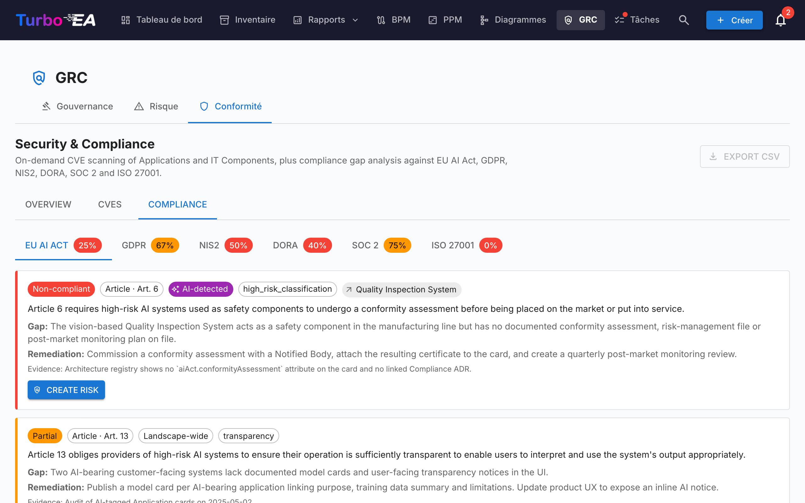

# GRC

Le module **GRC** réunit la Gouvernance, le Risque et la Conformité dans un espace de travail unique à `/grc`. Il regroupe des activités auparavant éparpillées entre Livraison EA et TurboLens, afin que l'architecte, le propriétaire de risque et l'examinateur de conformité partagent un terrain commun.

!!! note
    Le module GRC peut être activé ou désactivé par un administrateur dans les [Paramètres](../admin/settings.md). Lorsqu'il est désactivé, la navigation et les fonctionnalités GRC sont masquées.

GRC comporte trois onglets :

Tu peux pointer directement sur un onglet via `/grc?tab=governance`, `/grc?tab=risk` ou `/grc?tab=compliance`.


## Gouvernance

L'onglet Gouvernance se divise en deux **sous-onglets**, deep-linkables via `/grc?tab=governance&sub=principles` (par défaut) et `/grc?tab=governance&sub=decisions` :

### Principes

Navigateur en lecture seule des Principes EA publiés dans le métamodèle (énoncé, justification, implications). Le catalogue se modifie depuis **Administration → Métamodèle → Principes**.

### Décisions


Le sous-onglet Décisions est le **registre principal des Architecture Decision Records (ADR)** — chaque ADR à l'échelle du paysage, indépendamment de l'initiative à laquelle il est lié. Il remplace l'ancien onglet Décisions d'EA Delivery, dissous lors de l'arrivée du module GRC.

Les ADR documentent les décisions d'architecture importantes ainsi que leur contexte, conséquences et alternatives envisagées. Les décisions émises par l'assistant TurboLens Architect arrivent ici sous forme de brouillons à valider.

#### Colonnes du tableau

La grille ADR reprend la disposition de la grille Inventaire :

| Colonne | Description |
|---------|-------------|
| **N° de réf.** | Numéro de référence généré automatiquement (ADR-001, ADR-002, …) |
| **Titre** | Titre de l'ADR |
| **Statut** | Puce colorée — Brouillon, En revue ou Signé |
| **Cartes liées** | Pilules colorées correspondant à la couleur du type de chaque carte liée |
| **Créé** | Date de création |
| **Modifié** | Date de dernière modification |
| **Signé** | Date de signature |
| **Révision** | Numéro de révision |

#### Barre latérale de filtres

Une barre latérale de filtres persistante à gauche propose :

- **Types de carte** — cases à cocher avec des points colorés filtrant par types de cartes liées
- **Statut** — Brouillon / En revue / Signé
- **Date de création** / **Date de modification** / **Date de signature** — plages de dates de/à

Utilisez la barre de **filtre rapide** pour une recherche en texte intégral. Faites un clic droit sur n'importe quelle ligne pour un menu contextuel (**Modifier**, **Aperçu**, **Dupliquer**, **Supprimer**).

#### Créer un ADR

Les ADR peuvent être créés depuis trois endroits — tous ouvrent le même éditeur et alimentent le même registre :

1. **GRC → Gouvernance → Décisions** : cliquez sur **+ Nouvel ADR**, remplissez le titre et liez optionnellement des cartes (y compris des initiatives).
2. **Espace de travail EA Delivery** : sélectionnez une initiative, puis cliquez sur **+ Nouvel artefact ▾** en haut de la page (ou **+ Ajouter** dans la section *Décisions d'architecture*) et choisissez **Nouvelle décision d'architecture** — l'initiative est pré-liée.
3. **Carte → onglet Ressources** : cliquez sur **Créer ADR** — la carte courante est pré-liée.

Dans tous les cas, vous pouvez rechercher et lier des cartes supplémentaires lors de la création. Les initiatives sont liées via le même mécanisme de liaison de cartes que toute autre carte, ce qui permet à un ADR de référencer plusieurs initiatives. L'éditeur s'ouvre avec des sections pour **Contexte**, **Décision**, **Conséquences** et **Alternatives envisagées**.

#### L'éditeur ADR

L'éditeur offre :

- Édition de texte riche pour chaque section (Contexte, Décision, Conséquences, Alternatives envisagées)
- Liaison de cartes — connectez l'ADR aux cartes pertinentes (applications, composants IT, initiatives, …). Les initiatives sont liées via la fonctionnalité standard de liaison de cartes, et non via un champ dédié, ce qui permet à un ADR de référencer plusieurs initiatives
- Décisions associées — référencez d'autres ADR

#### Workflow de signature

Les ADR prennent en charge un processus formel de signature :

1. Créez l'ADR avec le statut **Brouillon**.
2. Cliquez sur **Demander des signatures** et recherchez des signataires par nom ou e-mail.
3. L'ADR passe à **En revue** — chaque signataire reçoit une notification et une tâche.
4. Les signataires examinent et cliquent sur **Signer**.
5. Une fois que tous les signataires ont signé, l'ADR passe automatiquement au statut **Signé**.

Les ADR signés sont verrouillés et ne peuvent pas être modifiés — pour apporter des changements, créez une nouvelle révision.

#### Révisions

Ouvrez un ADR signé et cliquez sur **Réviser** pour créer un nouveau brouillon basé sur la version signée. La nouvelle révision hérite du contenu et des liaisons de cartes et reçoit un numéro de révision incrémentiel. Chaque révision conserve sa propre trace de signature.

#### Aperçu

Cliquez sur l'icône d'aperçu pour afficher une version en lecture seule et formatée de l'ADR — utile pour la revue avant signature.

## Risque


Intègre le **Registre des risques** TOGAF Phase G. Le cycle de vie complet, le workflow de statut, les bascules de matrice et le comportement des propriétaires sont documentés dans le [guide du Registre des risques](risks.md). L'essentiel :

## Conformité



Le scanner de sécurité à la demande, en deux moitiés indépendantes :

Les constats sont **durables au fil des re-scans** — les décisions utilisateur, les notes de revue, le verdict IA de l'utilisateur sur une fiche et le lien retour vers un Risque promu survivent aux scans ultérieurs. Un constat que le scan suivant ne signale plus est marqué `auto_resolved` et masqué par défaut ; le Risque précédemment promu reste intact pour ne pas rompre la piste d'audit.

La grille Conformité reflète celle de l'Inventaire : barre latérale de filtres avec bascule de visibilité des colonnes, tri persisté, recherche plein texte et un tiroir de détail qui affiche le cycle de vie de conformité comme une chronologie horizontale :

```
new → in_review → mitigated → verified
                      ↘ accepted          (justification requise)
                      ↘ not_applicable    (revue de périmètre)
                      ↘ risk_tracked      (positionné automatiquement lors d'une promotion)
```

Avec `security_compliance.manage`, coche la case du header pour une **sélection-tout filtrée**, puis utilise la barre d'outils épinglée pour **Modifier la décision** (transition par lot) ou **Supprimer** les constats sélectionnés. Les transitions illégales sont signalées ligne par ligne dans un résumé de succès partiel, de sorte qu'une seule mauvaise ligne ne fait pas échouer tout le lot. Voir [TurboLens → Sécurité & Conformité](turbolens.md#bulk-actions-on-the-compliance-grid) pour la référence complète des actions.

Lorsqu'un Risque promu depuis un constat est clôturé ou accepté, l'opération **se propage automatiquement vers le constat** — la ligne de conformité liée bascule sur `mitigated` / `verified` / `accepted` / `in_review` pour rester synchronisée, sans entretien manuel.

### Conformité sur une seule fiche

Les fiches dans le périmètre d'un scan de conformité exposent également un onglet **Conformité** sur leur page de détail (gouverné par `security_compliance.view`). Il liste chaque constat actuellement lié à la fiche avec les mêmes actions Acquitter / Accepter / **Créer un risque** / **Ouvrir le risque** que la vue GRC — de sorte qu'un Application Owner peut trier ses constats sans quitter la fiche.

## Permissions

| Permission | Rôles par défaut |
|------------|------------------|
| `grc.view` | admin, bpm_admin, member, viewer |
| `grc.manage` | admin, bpm_admin, member |
| `risks.view` / `risks.manage` | voir [Registre des risques § Permissions](risks.md) |
| `security_compliance.view` / `security_compliance.manage` | voir [TurboLens § Security & Compliance](turbolens.md) |

`grc.view` contrôle la visibilité de la route GRC elle-même — sans elle, l'entrée du menu supérieur est masquée. Chaque onglet impose en plus sa permission propre au domaine, de sorte qu'un visualiseur peut consulter le registre sans pouvoir déclencher un scan LLM, par exemple.
