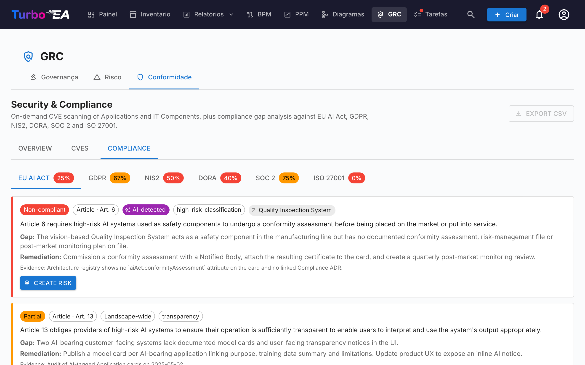

# GRC

O módulo **GRC** reúne Governança, Risco e Conformidade num único espaço de trabalho em `/grc`. Consolida tarefas que antes viviam entre Entrega EA e TurboLens, para que arquitetas, proprietários de risco e revisores de conformidade trabalhem sobre um terreno comum.

!!! note
    O módulo GRC pode ser habilitado ou desabilitado por um administrador em [Configurações](../admin/settings.md). Quando desabilitado, a navegação e os recursos do GRC ficam ocultos.

GRC tem três abas:

Você pode apontar diretamente para qualquer aba via `/grc?tab=governance`, `/grc?tab=risk` ou `/grc?tab=compliance`.

## Governança

A aba Governança divide-se em duas **sub-abas**, com link profundo via `/grc?tab=governance&sub=principles` (padrão) e `/grc?tab=governance&sub=decisions`:

### Princípios

Visualizador somente leitura dos Princípios EA publicados no metamodelo (declaração, justificativa, implicações). O catálogo é editado em **Administração → Metamodelo → Princípios**.

### Decisões

A sub-aba Decisões é o **registro principal dos Architecture Decision Records (ADR)** — cada ADR ao longo do panorama, independentemente da iniciativa à qual está vinculado. Substitui a antiga aba Decisões de Entregas de EA, dissolvida quando o módulo GRC entrou em cena.

Os ADR documentam decisões de arquitetura importantes junto com seu contexto, consequências e alternativas consideradas. As decisões emitidas pelo assistente TurboLens Architect chegam aqui como rascunhos para aprovação.

#### Colunas da tabela

A grade de ADR espelha o layout da grade de Inventário:

| Coluna | Descrição |
|--------|-----------|
| **N.º de ref.** | Número de referência gerado automaticamente (ADR-001, ADR-002, …) |
| **Título** | Título do ADR |
| **Status** | Chip colorido — Rascunho, Em Revisão ou Assinado |
| **Cards vinculados** | Pílulas coloridas correspondentes à cor do tipo de cada card vinculado |
| **Criado** | Data de criação |
| **Modificado** | Data da última modificação |
| **Assinado** | Data de assinatura |
| **Revisão** | Número de revisão |

#### Barra lateral de filtros

A barra lateral de filtros persistente à esquerda oferece:

- **Tipos de card** — caixas de seleção com pontos coloridos que filtram por tipos de cards vinculados
- **Status** — Rascunho / Em Revisão / Assinado
- **Data de criação / modificação / assinatura** — intervalos de datas de/até

Use a barra de **filtro rápido** para pesquisa de texto completo. Clique com o botão direito em qualquer linha para um menu de contexto (**Editar**, **Pré-visualizar**, **Duplicar**, **Excluir**).

#### Criar um ADR

Os ADR podem ser criados a partir de três locais — todos abrem o mesmo editor e alimentam o mesmo registro:

1. **GRC → Governança → Decisões**: clique em **+ Novo ADR**, preencha o título e opcionalmente vincule cards (incluindo iniciativas).
2. **Espaço de trabalho de Entregas de EA**: selecione uma iniciativa, clique em **+ Novo artefato ▾** no cabeçalho da página (ou **+ Adicionar** na secção *Decisões de Arquitetura*) e escolha **Nova Decisão de Arquitetura** — a iniciativa fica pré-vinculada.
3. **Card → aba Recursos**: clique em **Criar ADR** — o card atual fica pré-vinculado.

Em todos os casos você pode pesquisar e vincular cards adicionais durante a criação. As iniciativas são vinculadas através do mesmo mecanismo de vinculação de cards de qualquer outro card, de modo que um ADR pode referenciar múltiplas iniciativas. O editor abre com seções para **Contexto**, **Decisão**, **Consequências** e **Alternativas Consideradas**.

#### O Editor de ADR

O editor oferece:

- Edição de texto rico para cada seção (Contexto, Decisão, Consequências, Alternativas Consideradas)
- Vinculação de cards — conecte o ADR a cards relevantes (aplicações, componentes de TI, iniciativas, …). As iniciativas são vinculadas através da vinculação padrão de cards, não por um campo dedicado, permitindo que um ADR referencie múltiplas iniciativas
- Decisões relacionadas — referencie outros ADR

#### Fluxo de Assinatura

Os ADR suportam um processo formal de assinatura:

1. Crie o ADR no status **Rascunho**.
2. Clique em **Solicitar Assinaturas** e pesquise signatários por nome ou e-mail.
3. O ADR passa para **Em Revisão** — cada signatário recebe uma notificação e uma tarefa.
4. Os signatários revisam e clicam em **Assinar**.
5. Quando todos os signatários assinarem, o ADR passa automaticamente para o status **Assinado**.

ADR assinados ficam bloqueados e não podem ser editados — para mudanças crie uma nova revisão.

#### Revisões

Abra um ADR assinado e clique em **Revisar** para criar um novo rascunho baseado na versão assinada. A nova revisão herda o conteúdo e os vínculos de cards e recebe um número de revisão incremental. Cada revisão mantém o seu próprio rastro de assinaturas.

#### Pré-visualização

Clique no ícone de pré-visualização para ver uma versão somente leitura e formatada do ADR — útil para revisão antes de assinar.

## Risco

Incorpora o **Registro de riscos** TOGAF Fase G. Ciclo de vida completo, fluxo de status, alternadores da matriz e comportamento dos proprietários estão documentados no [guia do Registro de riscos](risks.md). Os pontos mais relevantes:

## Conformidade

A aba Conformidade é um registro de fonte dupla — descobertas podem ser **redigidas manualmente** por um revisor **ou** produzidas por uma **varredura IA** sob demanda contra as regulamentações habilitadas (EU AI Act, LGPD/GDPR, NIS2, DORA, SOC 2, ISO 27001 vêm habilitadas por padrão). Ambos os tipos de descoberta compartilham o mesmo ciclo de vida, podem ser promovidos a um Risco e bulk-actionados a partir da grade. Veja o [guia de Conformidade](compliance.md) para o ciclo de vida completo, o diálogo de criação manual, o fluxo de varredura, o detector semântico EU AI Act e o loop de promoção a Risco.

A mesma aba Conformidade também aparece no Detalhe do card (auto-ocultada quando o card não tem descobertas vinculadas), de modo que um Application Owner possa triar suas descobertas sem sair do card.

## Permissões

| Permissão | Papéis padrão |
|-----------|---------------|
| `grc.view` | admin, bpm_admin, member, viewer |
| `grc.manage` | admin, bpm_admin, member |
| `risks.view` / `risks.manage` | ver [Registro de riscos § Permissões](risks.md) |
| `security_compliance.view` / `security_compliance.manage` | ver [TurboLens § Security & Compliance](turbolens.md) |

`grc.view` controla a visibilidade da própria rota GRC — sem ele, a entrada do menu superior fica oculta. Cada aba ainda impõe sua própria permissão de domínio, de modo que uma visualizadora possa ler o registro sem poder disparar uma varredura LLM, por exemplo.
