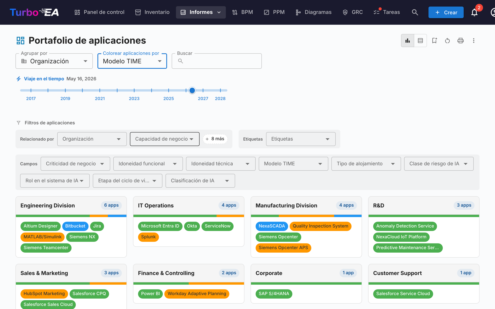

# Informes

Turbo EA incluye un potente módulo de **informes visuales** que permite analizar la arquitectura empresarial desde diferentes perspectivas. Todos los informes pueden ser [guardados para reutilización](saved-reports.es.md) con su configuración actual de filtros y ejes.

## Informe de Portafolio

El **Informe de Portafolio** muestra un **gráfico de burbujas** (o diagrama de dispersión) configurable de sus fichas. Usted elige qué representa cada eje:

- **Eje X** — Seleccione cualquier campo numérico o de selección (por ejemplo, Idoneidad Técnica)
- **Eje Y** — Seleccione cualquier campo numérico o de selección (por ejemplo, Criticidad de Negocio)
- **Tamaño de burbuja** — Asigne a un campo numérico (por ejemplo, Costo Anual)
- **Color de burbuja** — Asigne a un campo de selección o estado del ciclo de vida

Esto es ideal para el análisis de portafolio — por ejemplo, representar aplicaciones por valor de negocio vs. aptitud técnica para identificar candidatos para inversión, reemplazo o retiro.

### Análisis IA del portafolio

Cuando la IA está configurada y los análisis de portafolio están habilitados por un administrador, el informe de portafolio muestra un botón **Análisis IA**. Al hacer clic, se envía un resumen de la vista actual al proveedor de IA, que devuelve análisis estratégicos sobre riesgos de concentración, oportunidades de modernización, preocupaciones del ciclo de vida y equilibrio del portafolio. El panel de análisis es plegable y puede regenerarse después de cambiar filtros o agrupaciones.

## Portafolio flexible

El **Portafolio flexible** usa los mismos controles que el Portafolio de aplicaciones pero añade un selector de **Tipo de tarjeta** en la parte superior de la barra de herramientas. Permite analizar un portafolio de Capacidades de Negocio, Iniciativas, Componentes de TI o cualquier otro tipo de tarjeta visible con la misma experiencia de agrupación, coloreado y filtros.

La captura muestra un caso de uso típico: elija **Objeto de Datos** como tipo de tarjeta, **Agrupar por → Aplicación** para ver qué aplicación posee qué datos y **Colorear por → Sensibilidad de Datos** para identificar de un vistazo dónde residen los datos confidenciales.

Cambiar el tipo de tarjeta restablece las selecciones de agrupación, color y filtros (hacen referencia a claves de campo que no existen en el nuevo tipo) y el informe se recarga con los campos, relaciones y etiquetas aplicables al tipo elegido. El informe comparte el mismo permiso que el Portafolio de aplicaciones (`reports.portfolio`) y se guarda de forma independiente.

## Mapa de Capacidades

El **Mapa de Capacidades** muestra un **mapa de calor** jerárquico de las capacidades de negocio de la organización. Cada bloque representa una capacidad, con:

- **Jerarquía** — Las capacidades principales contienen sus sub-capacidades
- **Coloración por mapa de calor** — Los bloques se colorean según una métrica seleccionada (por ejemplo, número de aplicaciones que las soportan, calidad de datos promedio o nivel de riesgo)
- **Clic para explorar** — Haga clic en cualquier capacidad para profundizar en sus detalles y aplicaciones de soporte

## Informe de Ciclo de Vida

El **Informe de Ciclo de Vida** muestra una **visualización de línea temporal** de cuándo se introdujeron los componentes tecnológicos y cuándo está planificado su retiro. Es crítico para:

- **Planificación de retiro** — Vea qué componentes se acercan al fin de vida
- **Planificación de inversión** — Identifique brechas donde se necesita nueva tecnología
- **Coordinación de migración** — Visualice períodos superpuestos de entrada y salida de fase

Los componentes se muestran como barras horizontales que abarcan sus fases de ciclo de vida: Plan, Fase de Entrada, Activo, Fase de Salida y Fin de Vida.

## Informe de Dependencias

El **Informe de Dependencias** visualiza las **conexiones entre componentes** como un grafo de red. Los nodos representan fichas y las aristas representan relaciones. Características:

- **Control de profundidad** — Limite cuántos saltos desde el nodo central se muestran (limitación de profundidad BFS)
- **Filtrado por tipo** — Muestre solo tipos de fichas y tipos de relaciones específicos
- **Exploración interactiva** — Haga clic en cualquier nodo para recentrar el grafo en esa ficha
- **Análisis de impacto** — Comprenda el radio de impacto de los cambios en un componente específico

### Layered Dependency View (vista de dependencias por capas)

Cambie a la **Layered Dependency View** utilizando los botones de modo de vista en la barra de herramientas. Es la notación propia de Turbo EA para mostrar dependencias entre fichas a través de las cuatro capas EA — inspirada en el principio de estratificación de ArchiMate y en la filosofía de «buenos valores por defecto» del modelo C4, pero distinta de ambos:

- **Carriles por capa** — Las fichas se agrupan por capa arquitectónica (Estrategia y Transformación, Arquitectura de Negocio, Aplicación y Datos, Arquitectura Técnica) dentro de rectángulos de contorno punteados, en orden fijo
- **Nodos coloreados por tipo** — Cada nodo se colorea según su tipo de ficha y se etiqueta con el nombre y el tipo de la ficha
- **Aristas dirigidas y etiquetadas** — Las aristas siguen la dirección de la relación del metamodelo (origen → destino) y llevan la etiqueta directa de la relación (por ej. *usa*, *soporta*, *se ejecuta en*)
- **Fichas propuestas** — En el asistente de TurboLens Architect, las fichas aún no confirmadas tienen un borde punteado y una insignia verde **NEW**
- **Lienzo interactivo** — Desplace, haga zoom y use el minimapa para navegar por diagramas grandes
- **Clic para inspeccionar** — Haga clic en cualquier nodo para abrir el panel lateral de detalle de la ficha
- **Sin ficha central requerida** — La Layered Dependency View muestra todas las fichas que coinciden con el filtro de tipo actual
- **Resaltado de conexiones** — Pase el cursor sobre una ficha para resaltar sus conexiones; en dispositivos táctiles, use el botón de resaltado en el panel de controles para resaltar al tocar

La misma vista se reutiliza en la página de detalle de la ficha (mostrando el vecindario inmediato de dependencias de la ficha) y en el asistente [TurboLens Architect](turbolens.md#architecture-ai), de modo que las dependencias se ven igual en todas partes.

## Informe de Costos

El **Informe de Costos** proporciona un análisis financiero de su panorama tecnológico:

- **Vista de mapa de árbol** — Rectángulos anidados dimensionados por costo, con agrupación opcional (por ejemplo, por organización o capacidad)
- **Vista de gráfico de barras** — Comparación de costos entre componentes
- **Tipo de tarjeta** — Elija el tipo de tarjeta sobre el que se construye el informe (Aplicación, Componente TI, Proveedor, …).

### Origen de los costes

Cuando el tipo de tarjeta seleccionado tiene al menos un tipo de relación que apunta a un tipo con un campo de coste, aparece un selector **Origen de los costes** junto a **Tipo de tarjeta**. Permite escoger de dónde proceden las cifras:

- **Directo (este tipo de tarjeta)** — opción por defecto; suma el campo de coste de las propias tarjetas mostradas. Úselo cuando consulte directamente *Aplicaciones* o *Componentes TI*.
- **Agregar desde tarjetas relacionadas** — marque una o varias entradas `Tipo · Campo` (por ejemplo `Aplicación · Coste anual total`, `Componente TI · Coste anual total`). El valor de cada tarjeta primaria pasa a ser la suma de ese campo en sus tarjetas relacionadas.

El selector es **de selección múltiple**, de modo que una misma consolidación puede combinar varios tipos relacionados. Por ejemplo, al consultar el **Proveedor** *Microsoft*, marcar a la vez `Aplicación · Coste anual total` y `Componente TI · Coste anual total` muestra la huella completa del proveedor —Teams, M365, Azure y cualquier otro componente suministrado por Microsoft— como una única cifra.

#### Por qué nada se cuenta dos veces

El selector está diseñado para que la doble contabilización sea imposible por construcción:

- Cada entrada es un par único `(tipo destino, campo de coste)`; la lista ofrece cada par exactamente una vez, incluso cuando varios tipos de relación alcanzan el mismo tipo destino.
- Dentro de un mismo par, dos tarjetas conectadas por varios tipos de relación contribuyen con su coste una sola vez.
- Entre entradas distintas, ninguna tarjeta puede contribuir dos veces: una tarjeta tiene un único tipo, y los distintos campos de coste de una misma tarjeta son valores independientes.

Un pequeño **icono de ayuda (?)** junto al selector recuerda esta garantía al pasar el ratón.

La lista de opciones se genera a partir de su metamodelo —los tipos de relación y los campos de coste se descubren en tiempo de renderizado, de modo que cualquier tipo de tarjeta o relación personalizada que añada se convierte automáticamente en un Origen de los costes válido.

### Profundizar en un rectángulo

Siempre que haya al menos un Origen de los costes activo, los rectángulos del mapa de árbol son **clicables**. Al hacer clic en uno, el gráfico se sustituye por el desglose del coste de ese rectángulo: las tarjetas relacionadas que contribuyeron a su consolidación, dimensionadas por su coste directo. Sobre el gráfico aparece una ruta de navegación, p. ej. **Todas las Aplicaciones › NexaCore ERP**; haga clic en cualquier segmento para retroceder.

- **Un único Origen de costes activo** — el desglose muestra un mapa de árbol de las tarjetas relacionadas (por ejemplo, al hacer clic en *NexaCore ERP* con `Componente TI · Coste anual total` marcado se muestran los Componentes TI vinculados a NexaCore ERP, dimensionados por su coste anual).
- **Varios Orígenes de costes activos** — el desglose muestra **un mapa de árbol por origen, en paralelo** (1 columna en pantallas estrechas, 2 en pantallas amplias). Cada panel tiene su propio encabezado, su propio total y su propio `% del total` en la información sobre herramientas, de modo que los distintos tipos de tarjeta conservan su escala en lugar de mezclarse en un único gráfico.

El control deslizante de cronología, la selección de Origen de los costes y los demás filtros se conservan al profundizar, y el nivel de desglose forma parte de la configuración del informe guardado: guardar un informe mientras se está profundizando lo abre directamente en ese nivel. Sin un Origen de costes activo, hacer clic en un rectángulo abre en su lugar el panel lateral de la tarjeta (no hay nada que desglosar).

## Informe de Matriz

El **Informe de Matriz** crea una **cuadrícula de referencias cruzadas** entre dos tipos de fichas. Por ejemplo:

- **Filas** — Aplicaciones
- **Columnas** — Capacidades de Negocio
- **Celdas** — Indican si existe una relación (y cuántas)

Esto es útil para identificar brechas de cobertura (capacidades sin aplicaciones de soporte) o redundancias (capacidades soportadas por demasiadas aplicaciones).

## Informe de Calidad de Datos

El **Informe de Calidad de Datos** es un **panel de completitud** que muestra qué tan bien están completados los datos de su arquitectura. Basado en los pesos de campos configurados en el metamodelo:

- **Puntuación general** — Calidad de datos promedio en todas las fichas
- **Por tipo** — Desglose que muestra qué tipos de fichas tienen la mejor/peor completitud
- **Fichas individuales** — Lista de fichas con la calidad de datos más baja, priorizadas para mejora

## Informe de Fin de Vida (EOL)

El **Informe de EOL** muestra el estado de soporte de los productos tecnológicos vinculados a través de la función de [Administración de EOL](../admin/eol.es.md):

- **Distribución de estados** — Cuántos productos tienen Soporte, se Acercan a EOL o están en Fin de Vida
- **Línea temporal** — Cuándo los productos perderán soporte
- **Priorización de riesgos** — Enfóquese en componentes de misión crítica que se acercan a EOL

## Informes Guardados

Guarde cualquier configuración de informe para acceso rápido. Los informes guardados incluyen una vista previa en miniatura y pueden compartirse en toda la organización.

## Exportar Informes

Todos los informes admiten **Exportar a Excel (.xlsx)** y **Exportar a PowerPoint (.pptx)** desde el menú **⋮** de la barra de título (junto a Imprimir y Copiar enlace).

- **Excel** — Genera una hoja por cada tabla de datos visible, con columnas dimensionadas automáticamente y formato de moneda / número preservado. Cambie a la **vista de tabla** antes de exportar para capturar las filas subyacentes.
- **PowerPoint** — Crea una presentación cuya primera diapositiva combina el título del informe, la marca de tiempo de generación, el resumen de filtros activos y el gráfico en vivo con calidad de presentación. Las diapositivas siguientes paginan las tablas para entregables compartibles.

Los filtros y agrupaciones activos en el momento de la exportación se registran en la diapositiva de título o en la cabecera, manteniendo las exportaciones autoexplicativas.

## Mapa de Procesos

El **Mapa de Procesos** visualiza el panorama de procesos de negocio de la organización como un mapa estructurado, mostrando las categorías de procesos (Gestión, Principal, Soporte) y sus relaciones jerárquicas.
