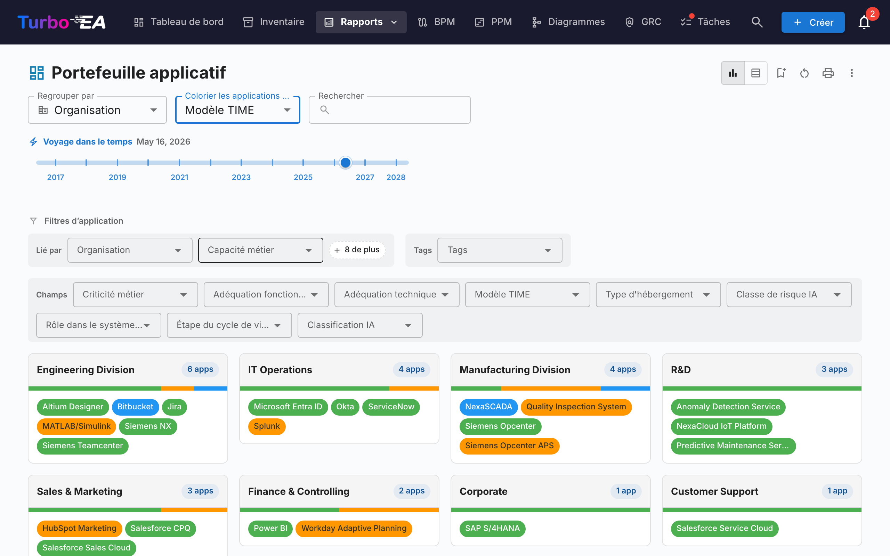

# Rapports

Turbo EA inclut un puissant module de **rapports visuels** permettant d'analyser l'architecture d'entreprise sous différents angles. Tous les rapports peuvent être [sauvegardés pour réutilisation](saved-reports.md) avec leur configuration actuelle de filtres et d'axes.

## Rapport Portefeuille

Le **Rapport Portefeuille** affiche un **graphique à bulles** (ou nuage de points) configurable de vos fiches. Vous choisissez ce que chaque axe représente :

- **Axe X** -- Sélectionnez n'importe quel champ numérique ou de sélection (par ex. Adéquation Technique)
- **Axe Y** -- Sélectionnez n'importe quel champ numérique ou de sélection (par ex. Criticité Métier)
- **Taille de la bulle** -- Associer à un champ numérique (par ex. Coût Annuel)
- **Couleur de la bulle** -- Associer à un champ de sélection ou à l'état du cycle de vie

C'est idéal pour l'analyse de portefeuille -- par exemple, positionner les applications par valeur métier vs adéquation technique pour identifier les candidats à l'investissement, au remplacement ou au retrait.

### Analyses IA du portefeuille

Lorsque l'IA est configurée et que les analyses de portefeuille sont activées par un administrateur, le rapport de portefeuille affiche un bouton **Analyses IA**. Un clic envoie un résumé de la vue actuelle au fournisseur IA, qui renvoie des analyses stratégiques sur les risques de concentration, les opportunités de modernisation, les préoccupations de cycle de vie et l'équilibre du portefeuille. Le panneau d'analyses est repliable et peut être régénéré après modification des filtres ou du regroupement.

## Portefeuille flexible

Le **Portefeuille flexible** utilise les mêmes contrôles que le Portefeuille applicatif mais ajoute un sélecteur **Type de carte** en haut de la barre d'outils. Il permet d'analyser un portefeuille de Capacités métier, d'Initiatives, de Composants IT ou de tout autre type de carte visible avec la même expérience de regroupement, de coloration et de filtrage.

La capture ci-dessus illustre un cas d'usage typique : choisissez **Objet de données** comme type de carte, **Regrouper par → Application** pour voir quelle application détient quelles données, et **Colorier par → Sensibilité des données** pour repérer d'un coup d'œil où se trouvent les données confidentielles.

Changer de type de carte réinitialise les sélections de regroupement, de coloration et de filtres (elles référencent des clés de champs qui n'existent pas sur le nouveau type) et le rapport est rechargé avec les champs, relations et tags applicables au type choisi. Le rapport partage la même permission que le Portefeuille applicatif (`reports.portfolio`) et est enregistré indépendamment.

## Carte de capacités

La **Carte de capacités** affiche une **carte thermique hiérarchique** des capacités métier de l'organisation. Chaque bloc représente une capacité, avec :

- **Hiérarchie** -- Les capacités principales contiennent leurs sous-capacités
- **Coloration thermique** -- Les blocs sont colorés en fonction d'une métrique sélectionnée (par ex. nombre d'applications de support, qualité moyenne des données, ou niveau de risque)
- **Cliquer pour explorer** -- Cliquez sur n'importe quelle capacité pour approfondir ses détails et ses applications de support

## Rapport Cycle de vie

Le **Rapport Cycle de vie** affiche une **visualisation chronologique** indiquant quand les composants technologiques ont été introduits et quand leur retrait est prévu. Essentiel pour :

- **Planification du retrait** -- Voir quels composants approchent de la fin de vie
- **Planification des investissements** -- Identifier les lacunes où une nouvelle technologie est nécessaire
- **Coordination des migrations** -- Visualiser les périodes de chevauchement entre mise en service et retrait progressif

Les composants sont affichés sous forme de barres horizontales couvrant leurs phases de cycle de vie : Planification, Mise en service, Actif, Retrait progressif et Fin de vie.

## Rapport Dépendances

Le **Rapport Dépendances** visualise les **connexions entre composants** sous forme de graphe réseau. Les nœuds représentent les fiches et les arêtes représentent les relations. Fonctionnalités :

- **Contrôle de profondeur** -- Limiter le nombre de sauts depuis le nœud central à afficher (limitation de profondeur BFS)
- **Filtrage par type** -- Afficher uniquement des types de fiches et types de relations spécifiques
- **Exploration interactive** -- Cliquer sur n'importe quel nœud pour recentrer le graphe sur cette fiche
- **Analyse d'impact** -- Comprendre le rayon d'impact des modifications sur un composant spécifique

### Layered Dependency View (vue de dépendances par couches)

Basculez vers la **Layered Dependency View** à l'aide des boutons de mode d'affichage dans la barre d'outils. Il s'agit de la notation maison de Turbo EA pour représenter les dépendances entre fiches selon les quatre couches EA — inspirée du principe de stratification d'ArchiMate et de la philosophie « bons défauts » du modèle C4, mais distincte des deux :

- **Couloirs par couche** — Les fiches sont regroupées par couche architecturale (Stratégie & Transformation, Architecture Métier, Application & Données, Architecture Technique) dans des rectangles de périmètre en pointillés, dans un ordre fixe
- **Nœuds colorés par type** — Chaque nœud est coloré selon son type de fiche et étiqueté avec le nom et le type de la fiche
- **Arêtes orientées et étiquetées** — Les arêtes suivent la direction de la relation du métamodèle (source → cible) et portent l'étiquette directe de la relation (par ex. *utilise*, *supporte*, *s'exécute sur*)
- **Fiches proposées** — Dans l'assistant TurboLens Architect, les fiches non encore validées ont une bordure en pointillés et un badge vert **NEW**
- **Canevas interactif** — Déplacez, zoomez et utilisez la minimap pour naviguer dans les grands diagrammes
- **Cliquer pour inspecter** — Cliquez sur n'importe quel nœud pour ouvrir le panneau latéral de détail de la fiche
- **Pas de fiche centrale requise** — La Layered Dependency View affiche toutes les fiches correspondant au filtre de type actuel
- **Mise en surbrillance des connexions** — Survolez une fiche pour mettre en surbrillance ses connexions ; sur les appareils tactiles, utilisez le bouton de surbrillance dans le panneau de contrôle pour mettre en surbrillance par toucher

La même vue est réutilisée sur la page de détail de fiche (montrant le voisinage de dépendances immédiat de la fiche) et dans l'assistant [TurboLens Architect](turbolens.md#architecture-ai), afin que les dépendances apparaissent de la même manière partout.

## Rapport Coûts

Le **Rapport Coûts** fournit une analyse financière de votre paysage technologique :

- **Vue treemap** -- Rectangles imbriqués dimensionnés par coût, avec regroupement optionnel (par ex. par organisation ou capacité)
- **Vue graphique à barres** -- Comparaison des coûts entre composants
- **Type de carte** -- Choisissez le type de carte autour duquel le rapport est construit (Application, Composant IT, Fournisseur, …).

### Source des coûts

Lorsque le type de carte sélectionné possède au moins un type de relation pointant vers un type qui détient un champ de coût, un sélecteur **Source des coûts** apparaît à côté du **Type de carte**. Il permet de choisir d'où viennent les chiffres :

- **Direct (ce type de carte)** -- valeur par défaut ; additionne le champ de coût sur les cartes affichées elles-mêmes. À utiliser pour examiner directement les *Applications* ou les *Composants IT*.
- **Agréger depuis des cartes liées** -- cochez une ou plusieurs entrées `Type · Champ` (par exemple `Application · Coût annuel total`, `Composant IT · Coût annuel total`). La valeur de chaque carte primaire devient alors la somme de ce champ sur ses cartes liées.

Le sélecteur est **multi-sélection**, ce qui permet à une seule consolidation de combiner plusieurs types liés. Par exemple, en consultant le **Fournisseur** *Microsoft*, cocher à la fois `Application · Coût annuel total` et `Composant IT · Coût annuel total` montre l'empreinte complète de l'éditeur — Teams, M365, Azure et tout autre composant fourni par Microsoft — sous la forme d'un chiffre unique.

#### Pourquoi rien n'est compté deux fois

Le sélecteur est conçu pour rendre toute double-comptabilisation impossible par construction :

- Chaque entrée est une paire `(type cible, champ de coût)` unique -- la liste propose chaque paire exactement une fois, même lorsque plusieurs types de relation atteignent le même type cible.
- Au sein d'une même paire, deux cartes reliées par plusieurs types de relation ne contribuent leur coût qu'une seule fois.
- Entre entrées différentes, aucune carte ne peut contribuer deux fois : une carte n'a qu'un seul type, et différents champs de coût sur une même carte sont des valeurs indépendantes.

Une petite **icône d'aide (?)** placée à côté du sélecteur rappelle cette garantie au survol.

La liste des options est générée à partir de votre métamodèle -- les types de relation et les champs de coût sont découverts au moment du rendu, donc tout nouveau type de carte ou toute nouvelle relation devient automatiquement une source de coûts valide.

### Forer dans un rectangle

Dès qu'au moins une Source de coût est active, les rectangles du treemap deviennent **cliquables**. Un clic remplace le graphique par la décomposition du coût de ce rectangle — les fiches liées qui ont contribué à son agrégation, dimensionnées par leur coût direct. Un fil d'Ariane apparaît au-dessus du graphique, par exemple **Toutes les applications › NexaCore ERP** ; cliquez sur n'importe quel segment pour remonter.

- **Une seule Source de coût active** — le forage affiche un treemap des fiches liées (par exemple, cliquer sur *NexaCore ERP* avec `Composant SI · Coût annuel total` coché montre les composants SI liés à NexaCore ERP, dimensionnés par leur coût annuel).
- **Plusieurs Sources de coût actives** — le forage affiche **un treemap par source côte à côte** (1 colonne sur écran étroit, 2 sur écran large). Chaque panneau possède son propre en-tête, son propre total et son propre `% du total` dans l'infobulle — ainsi les différents types de fiches conservent leur échelle au lieu d'être tassés dans un seul graphique.

Le curseur de chronologie, la sélection de Source de coût et les autres filtres sont préservés pendant le forage, et le niveau de forage fait partie de la configuration du rapport sauvegardé — sauvegarder un rapport en cours de forage le rouvre directement à ce niveau. Sans Source de coût active, un clic sur un rectangle ouvre plutôt le panneau latéral de la fiche (il n'y a rien à décomposer).

## Rapport Matrice

Le **Rapport Matrice** crée une **grille de références croisées** entre deux types de fiches. Par exemple :

- **Lignes** -- Applications
- **Colonnes** -- Capacités Métier
- **Cellules** -- Indiquent si une relation existe (et combien)

Ceci est utile pour identifier les lacunes de couverture (capacités sans applications de support) ou les redondances (capacités supportées par trop d'applications).

## Rapport Qualité des données

Le **Rapport Qualité des données** est un **tableau de bord de complétude** qui montre à quel point vos données d'architecture sont bien renseignées. Basé sur les poids des champs configurés dans le métamodèle :

- **Score global** -- Qualité moyenne des données sur toutes les fiches
- **Par type** -- Ventilation montrant quels types de fiches ont la meilleure/pire complétude
- **Fiches individuelles** -- Liste des fiches avec la qualité de données la plus faible, priorisées pour amélioration

## Rapport Fin de vie (EOL)

Le **Rapport EOL** affiche le statut de support des produits technologiques liés via la fonctionnalité [Administration EOL](../admin/eol.md) :

- **Répartition des statuts** -- Combien de produits sont Supportés, Approchant la fin de vie, ou en Fin de vie
- **Chronologie** -- Quand les produits perdront leur support
- **Priorisation des risques** -- Se concentrer sur les composants critiques approchant la fin de vie

## Rapports sauvegardés

Sauvegardez n'importe quelle configuration de rapport pour un accès rapide ultérieur. Les rapports sauvegardés incluent un aperçu en miniature et peuvent être partagés dans toute l'organisation.

## Exporter les rapports

Chaque rapport prend en charge **Exporter vers Excel (.xlsx)** et **Exporter vers PowerPoint (.pptx)** depuis le menu **⋮** de la barre de titre (à côté de Imprimer et Copier le lien).

- **Excel** — Produit une feuille par tableau de données actuellement affiché, avec des colonnes dimensionnées automatiquement et le formatage des devises / nombres préservé. Basculez en **vue Tableau** avant l'export pour capturer les lignes sous-jacentes.
- **PowerPoint** — Génère un diaporama dont la première diapositive combine le titre du rapport, l'horodatage de génération, le résumé des filtres actifs et le graphique en direct en qualité de présentation. Les diapositives suivantes paginent les tableaux pour des supports partageables.

Les filtres et options de regroupement actifs au moment de l'export sont consignés sur la diapositive de titre ou dans l'en-tête, pour que les exports restent explicites.

## Carte de processus

La **Carte de processus** visualise le paysage des processus métier de l'organisation sous forme de carte structurée, montrant les catégories de processus (Management, Cœur de métier, Support) et leurs relations hiérarchiques.
