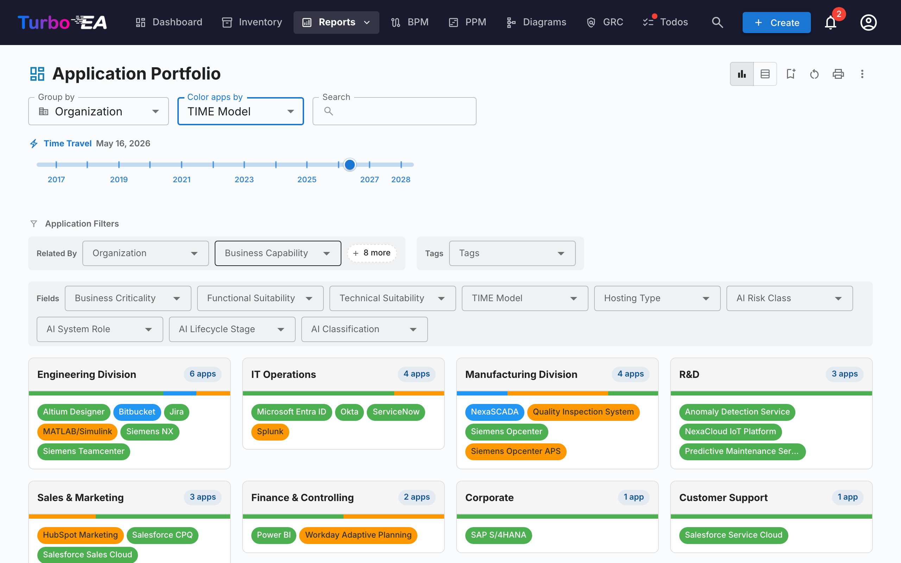

# Reports

Turbo EA includes a powerful **visual reporting** module that allows analyzing the enterprise architecture from different perspectives. All reports can be [saved for reuse](saved-reports.md) with their current filter and axis configuration.

## Portfolio Report

The **Portfolio Report** displays a configurable **bubble chart** (or scatter plot) of your cards. You choose what each axis represents:

- **X axis** — Select any numeric or select field (e.g., Technical Suitability)
- **Y axis** — Select any numeric or select field (e.g., Business Criticality)
- **Bubble size** — Map to a numeric field (e.g., Annual Cost)
- **Bubble color** — Map to a select field or lifecycle state

This is ideal for portfolio analysis — plotting applications by business value vs. technical fitness, for example, to identify candidates for investment, replacement, or retirement.

### AI Portfolio Insights

When AI is configured and portfolio insights are enabled by an admin, the portfolio report shows an **AI Insights** button. Clicking it sends a summary of your current view to the AI provider, which returns strategic insights about concentration risks, modernisation opportunities, lifecycle concerns, and portfolio balance. The insights panel is collapsible and can be regenerated after changing filters or grouping.

## Flexible Portfolio

The **Flexible Portfolio** uses the same controls as the Application Portfolio but adds a **Card type** picker at the top of the toolbar. Use it to analyse a portfolio of Business Capabilities, Initiatives, IT Components, or any other visible card type with the same grouping, colouring, and filter experience.

The screenshot above shows a typical use case: pick **Data Object** as the card type, **Group by → Application** to see which apps own which data, and **Color by → Data Sensitivity** to surface where confidential data lives at a glance.

Switching the card type clears the group-by, colour-by, and filter selections (they reference field keys that don't exist on the new type) and the report re-loads with the fields, relations, and tags applicable to the chosen type. The report shares the same permission as the Application Portfolio (`reports.portfolio`) and saves independently of it.

## Capability Map

The **Capability Map** shows a hierarchical **heatmap** of the organization's business capabilities. Each block represents a capability, with:

- **Hierarchy** — Main capabilities contain their sub-capabilities
- **Heatmap coloring** — Blocks are colored based on a selected metric (e.g., number of supporting applications, average data quality, or risk level)
- **Click to explore** — Click any capability to drill down into its details and supporting applications

## Lifecycle Report

The **Lifecycle Report** shows a **timeline visualization** of when technology components were introduced and when they are planned to be retired. Critical for:

- **Retirement planning** — See which components are approaching end-of-life
- **Investment planning** — Identify gaps where new technology is needed
- **Migration coordination** — Visualize overlapping phase-in and phase-out periods

Components are displayed as horizontal bars spanning their lifecycle phases: Plan, Phase In, Active, Phase Out, and End of Life.

## Dependencies Report

The **Dependencies Report** visualizes **connections between components** as a network graph. Nodes represent cards and edges represent relations. Features:

- **Depth control** — Limit how many hops from the center node to display (BFS depth limiting)
- **Type filtering** — Show only specific card types and relation types
- **Interactive exploration** — Click any node to recenter the graph on that card
- **Impact analysis** — Understand the blast radius of changes to a specific component

### Layered Dependency View

Toggle to the **Layered Dependency View** using the view-mode buttons in the toolbar. This is Turbo EA's house notation for showing dependencies between cards across the four EA layers — inspired by ArchiMate's layering and the C4 Model's "good defaults" philosophy, but distinct from both:

- **Layered swim lanes** — Cards are grouped by architectural layer (Strategy & Transformation, Business Architecture, Application & Data, Technical Architecture) inside dashed boundary rectangles, in fixed order
- **Type-colored nodes** — Each node is colored by its card type and labelled with the card name and type
- **Directional labelled edges** — Edges follow the metamodel relation direction (source → target) and carry the relation's forward label (e.g. *uses*, *supports*, *runs on*)
- **Proposed cards** — In the TurboLens Architect wizard, not-yet-committed cards have a dashed border and a green **NEW** badge
- **Interactive canvas** — Pan, zoom, and use the minimap to navigate large diagrams
- **Click to inspect** — Click any node to open the card detail side panel
- **No center card required** — The Layered Dependency View shows all cards matching the current type filter
- **Connection highlighting** — Hover over a card to highlight its connections; on touch devices, use the highlight toggle button in the controls panel to tap-highlight instead

The same view is reused on the Card Detail page (showing the card's immediate dependency neighbourhood) and in the [TurboLens Architect](turbolens.md#architecture-ai) wizard, so dependencies look the same everywhere.

## Cost Report

The **Cost Report** provides financial analysis of your technology landscape:

- **Treemap view** — Nested rectangles sized by cost, with optional grouping (e.g., by organization or capability)
- **Bar chart view** — Cost comparison across components
- **Card Type** — Pick which card type the report is built around (Application, IT Component, Provider, …).

### Cost Source

When the selected card type has at least one relation type pointing to a type that owns a cost field, a **Cost Source** picker appears next to **Card Type**. It lets you choose where the numbers come from:

- **Direct (this card type)** — default; sums the cost field on the displayed cards themselves. Use this when looking at *Applications* or *IT Components* directly.
- **Aggregate from related cards** — tick one or more `Type · Field` entries (for example `Application · Total Annual Cost`, `IT Component · Total Annual Cost`). Each primary card's number then becomes the sum of that field across its related cards.

The picker is **multi-select**, so a single roll-up can combine several related types in one go. For example, when viewing **Provider** for *Microsoft*, ticking both `Application · Total Annual Cost` and `IT Component · Total Annual Cost` shows the vendor's full footprint — Teams, M365, Azure, and any other Microsoft-supplied components — as one number.

#### Why nothing gets counted twice

The picker is built so that double-counting is impossible by construction:

- Each entry is a unique `(target type, cost field)` pair — the dropdown offers each pair exactly once, even when several relation types reach the same target type.
- Within a single pair, two cards linked through multiple relation types still contribute their cost only once.
- Across different entries, no card can contribute twice: a card has exactly one type, and different cost fields on the same card are independent values.

A small **help icon (?)** next to the picker repeats this guarantee on hover.

The option list is generated from your metamodel — relation types and cost fields are discovered at render time, so any custom card type or relation you add becomes a valid Cost Source automatically.

### Drill into a rectangle

Whenever at least one Cost Source is active, the treemap rectangles are **clickable**. Clicking one replaces the chart with the breakdown of that rectangle's cost — the related cards that contributed to its roll-up, sized by their direct cost. A breadcrumb appears above the chart, e.g. **All Applications › NexaCore ERP**; click any segment to walk back up.

- **Single Cost Source active** — drill renders one treemap of the related cards (e.g. clicking *NexaCore ERP* with `IT Component · Total Annual Cost` ticked shows the IT Components linked to NexaCore ERP, sized by their annual cost).
- **Multiple Cost Sources active** — drill renders **one treemap per source side-by-side** (1 column on narrow viewports, 2 on wide ones). Each panel has its own header, its own total, and its own per-panel `% of total` in the tooltip — so different card types stay on their own scale instead of being squashed into a single chart.

The timeline slider, Cost Source selection, and other filters are preserved as you drill, and the drilled level is part of the saved-report config — saving a report while drilled in re-opens directly at that level. With **no** Cost Source active, clicking a rectangle opens the card side panel instead (there's nothing to break down).

## Matrix Report

The **Matrix Report** creates a **cross-reference grid** between two card types. For example:

- **Rows** — Applications
- **Columns** — Business Capabilities
- **Cells** — Indicate whether a relation exists (and how many)

This is useful for identifying coverage gaps (capabilities with no supporting applications) or redundancies (capabilities supported by too many applications).

## Data Quality Report

The **Data Quality Report** is a **completeness dashboard** that shows how well your architecture data is filled in. Based on field weights configured in the metamodel:

- **Overall score** — Average data quality across all cards
- **By type** — Breakdown showing which card types have the best/worst completeness
- **Individual cards** — List of cards with the lowest data quality, prioritized for improvement

## End of Life (EOL) Report

The **EOL Report** shows the support status of technology products linked via the [EOL Administration](../admin/eol.md) feature:

- **Status distribution** — How many products are Supported, Approaching EOL, or End of Life
- **Timeline** — When products will lose support
- **Risk prioritization** — Focus on mission-critical components approaching EOL

## Saved Reports

Save any report configuration for quick access later. Saved reports include a thumbnail preview and can be shared across the organization.

## Exporting Reports

Every report supports **Export to Excel (.xlsx)** and **Export to PowerPoint (.pptx)** from the **⋮** menu in the title bar (alongside Print and Copy link).

- **Excel** — Produces one sheet per data table currently rendered, with auto-sized columns and currency / number formatting preserved. Switch to the **Table view** before exporting to capture the underlying rows.
- **PowerPoint** — Generates a deck whose first slide combines the report title, generation timestamp, active filter summary, and the live chart at presentation quality. Subsequent slides paginate the data tables for share-ready handouts.

Active filters and grouping options applied at the moment of export are recorded on the title slide / header row, so exports stay self-explanatory.

## Process Map

The **Process Map** visualizes the organization's business process landscape as a structured map, showing process categories (Management, Core, Support) and their hierarchical relationships.
