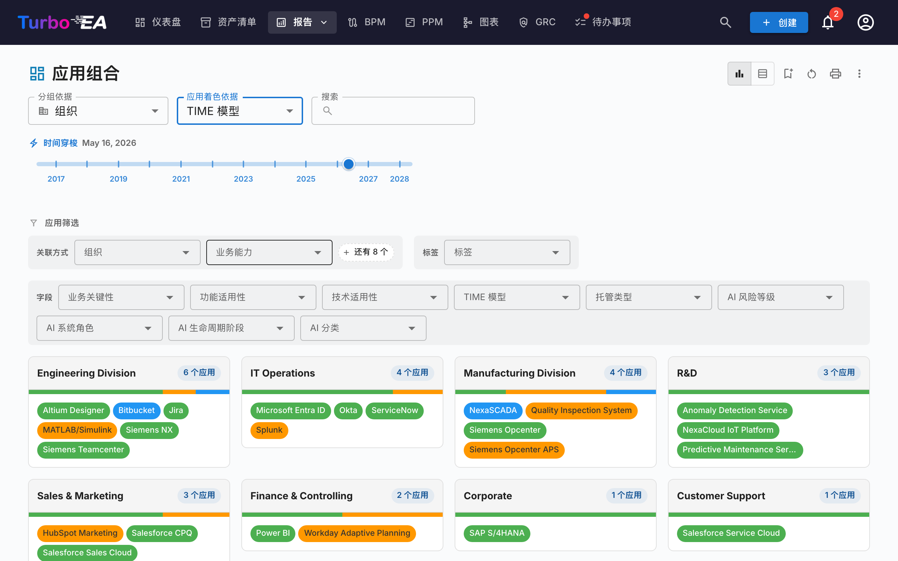

# 报告

Turbo EA 包含强大的**可视化报告**模块，允许从不同角度分析企业架构。所有报告都可以[保存以便复用](saved-reports.md)，包括当前的筛选和轴配置。

## 投资组合报告

**投资组合报告**显示卡片的可配置**气泡图**（或散点图）。您可以选择每个轴代表什么：

- **X 轴** —— 选择任何数字或选择字段（例如技术适用性）
- **Y 轴** —— 选择任何数字或选择字段（例如业务关键性）
- **气泡大小** —— 映射到数字字段（例如年度成本）
- **气泡颜色** —— 映射到选择字段或生命周期状态

这非常适合投资组合分析 —— 例如按业务价值与技术适用性绘制应用程序，以确定投资、替换或退役的候选对象。

### AI 投资组合洞察

当 AI 已配置且管理员已启用投资组合洞察时，投资组合报告会显示一个 **AI 洞察** 按钮。点击该按钮会将当前视图的摘要发送给 AI 提供商，后者会返回关于集中风险、现代化机会、生命周期问题和投资组合平衡的战略洞察。洞察面板可折叠，在更改筛选条件或分组后可以重新生成。

## 灵活组合分析

**灵活组合分析**与应用组合使用相同的控件，但在工具栏顶部新增了**卡片类型**选择器。可用于以相同的分组、着色和筛选体验，分析业务能力、计划、IT 组件或任何其他可见卡片类型的组合。

上图展示了一个典型用例：将卡片类型选为**数据对象**，**分组依据 → 应用**以查看每个应用拥有哪些数据，**着色依据 → 数据敏感性**则可一眼识别敏感数据所在的位置。

切换卡片类型会重置分组、着色和筛选项的选择（它们引用的字段键在新类型中不存在），报告会以所选类型适用的字段、关系和标签重新加载。该报告与应用组合共享相同权限（`reports.portfolio`），并独立保存。

## 能力地图

**能力地图**显示组织业务能力的层级**热力图**。每个块代表一个能力，具有：

- **层级结构** —— 主要能力包含其子能力
- **热力图着色** —— 块根据选定的指标着色（例如支持的应用程序数量、平均数据质量或风险等级）
- **点击探索** —— 点击任何能力可深入查看其详情和支持的应用程序

## 生命周期报告

**生命周期报告**显示技术组件引入时间和计划退役时间的**时间线可视化**。对以下方面至关重要：

- **退役规划** —— 查看哪些组件即将到达生命周期终点
- **投资规划** —— 识别需要新技术的空缺
- **迁移协调** —— 可视化引入和淘汰的重叠期

组件以横跨其生命周期阶段的水平条显示：规划、引入、活跃、淘汰和生命周期结束。

## 依赖关系报告

**依赖关系报告**将**组件之间的连接**可视化为网络图。节点代表卡片，边代表关系。功能包括：

- **深度控制** —— 限制从中心节点显示多少跳（BFS 深度限制）
- **类型筛选** —— 仅显示特定的卡片类型和关系类型
- **交互式探索** —— 点击任何节点将图表重新居中到该卡片
- **影响分析** —— 了解对特定组件变更的影响范围

### Layered Dependency View（分层依赖视图）

使用工具栏中的视图模式按钮切换到 **Layered Dependency View**。这是 Turbo EA 用于在四个 EA 层之间展示卡片之间依赖关系的自有表示法——受 ArchiMate 分层原则和 C4 模型「良好默认值」理念的启发，但与两者均不相同：

- **分层泳道** —— 卡片按架构层（战略与转型、业务架构、应用与数据、技术架构）以固定顺序分组在虚线边界矩形内
- **按类型着色的节点** —— 每个节点根据其卡片类型着色，并标注卡片名称和类型
- **有向带标签的边** —— 边遵循元模型关系方向（源 → 目标），并携带关系的正向标签（如「使用」、「支持」、「运行于」）
- **拟议卡片** —— 在 TurboLens Architect 向导中，尚未提交的卡片具有虚线边框和绿色 **NEW** 徽章
- **交互式画布** —— 平移、缩放并使用小地图导航大型图表
- **点击检查** —— 点击任何节点可打开卡片详情侧面板
- **无需中心卡片** —— Layered Dependency View 显示所有匹配当前类型筛选的卡片
- **连接高亮** —— 将鼠标悬停在卡片上可高亮显示其连接；在触控设备上，使用控制面板中的高亮切换按钮通过点击来高亮

同一视图也在卡片详情页面（显示该卡片的即时依赖邻域）和 [TurboLens Architect](turbolens.md#architecture-ai) 向导中复用，因此依赖关系在各处显示一致。

## 成本报告

**成本报告**提供技术架构的财务分析：

- **树状图视图** —— 按成本大小排列的嵌套矩形，可选分组（例如按组织或能力）
- **柱状图视图** —— 跨组件的成本比较
- **卡片类型** —— 选择报告所围绕的卡片类型（应用、IT 组件、供应商等）。

### 成本来源

当所选卡片类型至少存在一种指向带有成本字段的卡片类型的关系时，**卡片类型**旁会出现**成本来源**选择器，用于决定数据从何而来：

- **直接（此卡片类型）** —— 默认选项；对所显示卡片自身的成本字段求和。直接查看*应用*或*IT 组件*时使用。
- **从关联卡片聚合** —— 勾选一个或多个「类型 · 字段」条目（例如「应用 · 年度总成本」、「IT 组件 · 年度总成本」）。每张主卡片的数值即变为其关联卡片在该字段上的求和。

该选择器支持**多选**，因此一次汇总可以同时合并多种关联类型。例如，查看**供应商** *Microsoft* 时，同时勾选「应用 · 年度总成本」与「IT 组件 · 年度总成本」，便能将该厂商的完整覆盖范围 —— Teams、M365、Azure 以及微软提供的其他组件 —— 合并显示为一个数字。

#### 为什么不会重复计算

选择器在设计上即可防止重复计算：

- 每个条目都是唯一的「目标类型，成本字段」组合 —— 即使多个关系类型指向同一目标类型，列表中每个组合也仅出现一次。
- 在同一条目内，两张通过多种关系类型连接的卡片仍只贡献一次成本。
- 在不同条目之间，没有卡片会被计算两次：一张卡片只有一个类型，并且同一卡片上不同的成本字段是相互独立的数值。

选择器旁有一个小巧的**帮助图标（?）**，鼠标悬停时会重申该保证。

选项列表由您的元模型动态生成 —— 关系类型与成本字段会在渲染时被发现，因此任何新增的自定义卡片类型或关系都会自动成为有效的成本来源。

### 钻取到矩形内部

只要至少启用了一个成本来源，矩形即可**点击**。点击任一矩形会将图表替换为该矩形成本的明细——参与汇总的关联卡片，按其直接成本进行尺寸映射。图表上方会出现面包屑导航，例如「**全部 应用 › NexaCore ERP**」；点击任一段即可向上返回。

- **单一成本来源** —— 钻取后显示一张关联卡片的矩形树图（例如：勾选「IT 组件 · 年度总成本」后点击「NexaCore ERP」，会显示与 NexaCore ERP 关联的 IT 组件，按其年度成本进行尺寸映射）。
- **多个成本来源** —— 钻取后**每个来源并排显示一张矩形树图**（窄屏一列、宽屏两列）。每个面板都有独立的标题、独立的合计和独立的「占比」工具提示——不同卡片类型按各自的量级显示，不会被强行挤进一张图。

时间轴滑块、成本来源选择以及其他过滤条件都会在钻取过程中保留，钻取层级也是已保存报告配置的一部分——在钻取状态下保存报告，再次打开时会直接定位到该层级。如果没有任何成本来源处于启用状态，点击矩形会改为打开卡片侧边栏（因为没有可分解的内容）。

## 矩阵报告

**矩阵报告**创建两种卡片类型之间的**交叉引用网格**。例如：

- **行** —— 应用程序
- **列** —— 业务能力
- **单元格** —— 指示是否存在关系（以及多少个）

这对于识别覆盖空缺（没有支持应用程序的能力）或冗余（由太多应用程序支持的能力）非常有用。

## 数据质量报告

**数据质量报告**是一个**完整度仪表盘**，显示架构数据的填写程度。基于元模型中配置的字段权重：

- **总体评分** —— 所有卡片的平均数据质量
- **按类型** —— 显示哪些卡片类型完整度最好/最差的细分
- **单个卡片** —— 数据质量最低的卡片列表，优先改进

## 生命周期终止（EOL）报告

**EOL 报告**显示通过 [EOL 管理](../admin/eol.md)功能链接的技术产品的支持状态：

- **状态分布** —— 多少产品受支持、即将到期或已到期
- **时间线** —— 产品何时将失去支持
- **风险优先级** —— 关注即将到期的关键任务组件

## 已保存报告

保存任何报告配置以便日后快速访问。已保存的报告包含缩略图预览，可在组织内共享。

## 导出报告

每个报告都支持通过标题栏的 **⋮** 菜单（与「打印」「复制链接」并列）执行 **导出为 Excel (.xlsx)** 和 **导出为 PowerPoint (.pptx)**。

- **Excel** — 为当前显示的每个数据表生成一个工作表，列宽自动调整，并保留货币 / 数字格式。导出前切换到 **表格视图**，以便捕获底层行数据。
- **PowerPoint** — 生成的演示文稿首张幻灯片将报告标题、生成时间戳、活动筛选摘要与实时图表（演示级清晰度）整合在一起。后续幻灯片自动对数据表进行分页，便于分享。

导出时启用的筛选与分组设置会记录在标题幻灯片或表头中，使导出文件本身即可读懂。

## 流程地图

**流程地图**将组织的业务流程架构可视化为结构化地图，显示流程类别（管理、核心、支持）及其层级关系。
